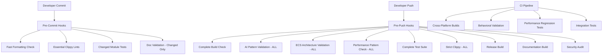

# Design Document

## Overview

The CI/CD Configuration system implements a two-tier validation approach with fast pre-commit checks and comprehensive pre-push validation. This design ensures code quality while maintaining developer productivity through optimized check timing and clear feedback mechanisms. The CI/CD pipeline enforces the project's "Feel Over Science" philosophy through automated behavioral validation (ensuring AI agents remain believable) and performance regression detection (maintaining the 60fps target with 100+ agents).

## Architecture

### Two-Tier Validation Strategy



### Performance-Optimized Check Distribution

**Pre-Commit (Target: <45 seconds total)**
- Formatting: 5 seconds
- Essential Clippy: 10 seconds  
- Unit Tests (changed): 25 seconds
- Documentation: 5 seconds

**Pre-Push (Target: <10 minutes total)**
- Build Check: 2 minutes
- Pattern Validation: 3 minutes
- Complete Tests: 4 minutes
- Documentation Build: 1 minute

## Components and Interfaces

### Git Hook Management System
```rust
/// Manages installation and configuration of Git hooks for quality gates.
#[derive(Debug)]
pub struct GitHookManager {
    pub hook_configurations: HashMap<HookType, HookConfiguration>,
    pub bypass_mechanisms: BypassConfiguration,
    pub progress_reporters: Vec<Box<dyn ProgressReporter>>,
    pub error_formatters: Vec<Box<dyn ErrorFormatter>>,
}

#[derive(Debug, Clone)]
pub enum HookType {
    PreCommit,
    PrePush,
    CommitMsg,
    PostCheckout,
}

#[derive(Debug, Clone)]
pub struct HookConfiguration {
    pub script_path: PathBuf,
    pub timeout_seconds: u64,
    pub required_tools: Vec<String>,
    pub environment_variables: HashMap<String, String>,
    pub bypass_conditions: Vec<BypassCondition>,
}

impl GitHookManager {
    pub fn install_hooks(&mut self, repository_path: &Path) -> Result<(), HookInstallationError> {
        let hooks_dir = repository_path.join(".git/hooks");
        
        for (hook_type, config) in &self.hook_configurations {
            let hook_file = hooks_dir.join(hook_type.filename());
            
            // Create hook script with proper permissions
            let hook_script = self.generate_hook_script(hook_type, config)?;
            std::fs::write(&hook_file, hook_script)?;
            
            // Set executable permissions
            #[cfg(unix)]
            {
                use std::os::unix::fs::PermissionsExt;
                let mut perms = std::fs::metadata(&hook_file)?.permissions();
                perms.set_mode(0o755);
                std::fs::set_permissions(&hook_file, perms)?;
            }
        }
        
        Ok(())
    }
    
    fn generate_hook_script(&self, hook_type: &HookType, config: &HookConfiguration) -> Result<String, ScriptGenerationError> {
        match hook_type {
            HookType::PreCommit => self.generate_pre_commit_script(config),
            HookType::PrePush => self.generate_pre_push_script(config),
            _ => Err(ScriptGenerationError::UnsupportedHookType),
        }
    }
    
    fn generate_pre_commit_script(&self, config: &HookConfiguration) -> Result<String, ScriptGenerationError> {
        Ok(format!(r#"#!/bin/bash
set -e

echo "🚀 Running pre-commit quality gates (FAST - Essential Only)..."

# Check for bypass conditions
if git diff --cached --name-only | grep -q "BYPASS_PRECOMMIT"; then
    echo "⚠️  Pre-commit checks bypassed via commit message"
    exit 0
fi

# 1. Code formatting check (target: 5 seconds)
echo "📝 Checking code formatting..."
timeout {timeout} cargo fmt --check || {{
    echo "❌ Code formatting failed. Run 'cargo fmt' to fix."
    exit 1
}}

# 2. Essential clippy lints (target: 10 seconds)  
echo "🔍 Running essential clippy checks..."
timeout {timeout} cargo clippy --workspace -- -D warnings || {{
    echo "❌ Clippy found issues. Fix warnings before committing."
    exit 1
}}

# 3. Unit tests for changed modules only (target: 25 seconds)
echo "🧪 Running tests for changed modules..."
CHANGED_FILES=$(git diff --cached --name-only --diff-filter=AM | grep '\.rs$' || true)
if [ ! -z "$CHANGED_FILES" ]; then
    # Extract module paths and run targeted tests
    timeout {timeout} cargo test --lib $(echo "$CHANGED_FILES" | sed 's/src\///g' | sed 's/\.rs$//g' | sed 's/\//:::/g' | tr '\n' ' ') || {{
        echo "❌ Unit tests failed for changed modules."
        exit 1
    }}
fi

# 4. Documentation validation for changed files only (target: 5 seconds)
echo "📚 Validating documentation for changed files..."
DOC_FILES=$(git diff --cached --name-only --diff-filter=AM | grep -E '\.(md|rs)$' || true)
if [ ! -z "$DOC_FILES" ]; then
    timeout {timeout} cargo doc --no-deps --document-private-items --quiet || {{
        echo "❌ Documentation build failed for changed files."
        exit 1
    }}
fi

echo "✅ Pre-commit checks passed! Commit allowed."
"#, timeout = config.timeout_seconds))
    }
    
    fn generate_pre_push_script(&self, config: &HookConfiguration) -> Result<String, ScriptGenerationError> {
        Ok(format!(r#"#!/bin/bash
set -e

echo "🔒 Running pre-push validation (COMPREHENSIVE - Everything)..."

# Check for bypass conditions
if git log --oneline -1 | grep -q "BYPASS_PREPUSH"; then
    echo "⚠️  Pre-push checks bypassed via commit message"
    exit 0
fi

# 1. Complete build check (target: 2 minutes)
echo "🏗️  Running complete build check..."
timeout {timeout} cargo build --workspace || {{
    echo "❌ Build failed. Fix compilation errors before pushing."
    exit 1
}}

# 2. AI pattern validation on ALL files (target: 1 minute)
echo "🧠 Validating AI patterns on ALL files..."
timeout {timeout} cargo run --bin ai-pattern-validator -- --all-files || {{
    echo "❌ AI pattern validation failed. Check personality traits, emotional ranges, and temporal consistency."
    exit 1
}}

# 3. Bevy ECS validation on ALL Rust files (target: 1 minute)
echo "⚙️  Validating Bevy ECS patterns on ALL Rust files..."
timeout {timeout} cargo run --bin ecs-pattern-validator -- --all-rust-files || {{
    echo "❌ ECS pattern validation failed. Check component design and system architecture."
    exit 1
}}

# 4. Performance pattern validation on ALL Rust files (target: 1 minute)
echo "⚡ Validating performance patterns on ALL Rust files..."
timeout {timeout} cargo run --bin performance-pattern-validator -- --all-rust-files || {{
    echo "❌ Performance pattern validation failed. Check for f64 usage and sync I/O in hot paths."
    exit 1
}}

# 5. Complete test suite (target: 4 minutes)
echo "🧪 Running complete test suite..."
timeout {timeout} cargo test --workspace || {{
    echo "❌ Test suite failed. Fix failing tests before pushing."
    exit 1
}}

# 6. Integration tests if they exist
if [ -d "tests" ]; then
    echo "🔗 Running integration tests..."
    timeout {timeout} cargo test --tests || {{
        echo "❌ Integration tests failed."
        exit 1
    }}
fi

# 7. Strict clippy with all lints enabled (target: 30 seconds)
echo "🔍 Running strict clippy validation..."
timeout {timeout} cargo clippy --workspace --all-targets --all-features -- -D warnings -D clippy::all -D clippy::pedantic || {{
    echo "❌ Strict clippy validation failed. Fix all lints before pushing."
    exit 1
}}

# 8. Release build validation (target: 2 minutes)
echo "🚀 Validating release build..."
timeout {timeout} cargo build --workspace --release || {{
    echo "❌ Release build failed. Fix release-specific issues before pushing."
    exit 1
}}

# 9. Documentation build validation (target: 1 minute)
echo "📚 Building complete documentation..."
timeout {timeout} cargo doc --workspace --no-deps --document-private-items || {{
    echo "❌ Documentation build failed. Fix doc comments and examples."
    exit 1
}}

# 10. Security audit (warning only)
echo "🔒 Running security audit..."
cargo audit || {{
    echo "⚠️  Security audit found issues (warning only - not blocking push)"
}}

echo "✅ Pre-push validation passed! Push allowed."
"#, timeout = config.timeout_seconds))
    }
}
```

### AI Pattern Validation Engine
```rust
/// Validates AI-specific coding patterns and conventions.
#[derive(Debug)]
pub struct AiPatternValidator {
    pub personality_trait_checker: PersonalityTraitChecker,
    pub emotional_state_checker: EmotionalStateChecker,
    pub temporal_consistency_checker: TemporalConsistencyChecker,
    pub system_modulation_checker: SystemModulationChecker,
    pub architecture_checker: ArchitectureChecker,
}

#[derive(Debug)]
pub struct PersonalityTraitChecker {
    pub valid_trait_types: HashSet<String>,
    pub required_range_documentation: bool,
    pub normalized_type_enforcement: bool,
}

impl PersonalityTraitChecker {
    pub fn validate_personality_component(&self, file_content: &str, file_path: &Path) -> ValidationResult {
        let mut issues = Vec::new();
        
        // Check for personality trait definitions
        let trait_regex = Regex::new(r"pub\s+(\w+):\s*([^,\n}]+)").unwrap();
        
        for captures in trait_regex.captures_iter(file_content) {
            let field_name = &captures[1];
            let field_type = &captures[2];
            
            // Check if it's a personality trait
            if self.is_personality_trait(field_name) {
                // Verify it uses Normalized<f32>
                if !field_type.contains("Normalized<f32>") {
                    issues.push(ValidationIssue {
                        issue_type: IssueType::IncorrectPersonalityType,
                        message: format!(
                            "Personality trait '{}' should use Normalized<f32>, found: {}",
                            field_name, field_type
                        ),
                        file_path: file_path.to_path_buf(),
                        line_number: self.find_line_number(file_content, &captures[0]),
                        suggestion: Some(format!(
                            "Change '{}' to 'Normalized<f32>' and add documentation: /// {}: 0.0 (low) to 1.0 (high)",
                            field_type, field_name
                        )),
                    });
                }
                
                // Check for range documentation
                if self.required_range_documentation && !self.has_range_documentation(file_content, field_name) {
                    issues.push(ValidationIssue {
                        issue_type: IssueType::MissingRangeDocumentation,
                        message: format!(
                            "Personality trait '{}' missing range documentation",
                            field_name
                        ),
                        file_path: file_path.to_path_buf(),
                        line_number: self.find_line_number(file_content, &captures[0]),
                        suggestion: Some(format!(
                            "Add documentation: /// {}: 0.0 (low) to 1.0 (high)",
                            field_name
                        )),
                    });
                }
            }
        }
        
        ValidationResult {
            file_path: file_path.to_path_buf(),
            passed: issues.is_empty(),
            issues,
            suggestions: self.generate_suggestions(&issues),
        }
    }
    
    fn is_personality_trait(&self, field_name: &str) -> bool {
        self.valid_trait_types.contains(&field_name.to_lowercase()) ||
        field_name.to_lowercase().contains("personality") ||
        ["openness", "conscientiousness", "extraversion", "agreeableness", "neuroticism"]
            .contains(&field_name.to_lowercase().as_str())
    }
}

#[derive(Debug)]
pub struct EmotionalStateChecker {
    pub valid_emotional_dimensions: HashSet<String>,
    pub required_bipolar_range: (f32, f32), // -1.0 to 1.0
}

impl EmotionalStateChecker {
    pub fn validate_emotional_component(&self, file_content: &str, file_path: &Path) -> ValidationResult {
        let mut issues = Vec::new();
        
        // Check for emotional state definitions
        let emotion_regex = Regex::new(r"pub\s+(\w+):\s*f32").unwrap();
        
        for captures in emotion_regex.captures_iter(file_content) {
            let field_name = &captures[1];
            
            if self.is_emotional_dimension(field_name) {
                // Check for proper range documentation
                if !self.has_bipolar_documentation(file_content, field_name) {
                    issues.push(ValidationIssue {
                        issue_type: IssueType::MissingBipolarDocumentation,
                        message: format!(
                            "Emotional dimension '{}' missing bipolar range documentation",
                            field_name
                        ),
                        file_path: file_path.to_path_buf(),
                        line_number: self.find_line_number(file_content, &captures[0]),
                        suggestion: Some(format!(
                            "Add documentation: /// {}: -1.0 (negative) to 1.0 (positive)",
                            field_name
                        )),
                    });
                }
                
                // Check for validation methods
                if !self.has_validation_method(file_content, field_name) {
                    issues.push(ValidationIssue {
                        issue_type: IssueType::MissingValidationMethod,
                        message: format!(
                            "Emotional dimension '{}' should have validation method",
                            field_name
                        ),
                        file_path: file_path.to_path_buf(),
                        line_number: self.find_line_number(file_content, &captures[0]),
                        suggestion: Some(format!(
                            "Add validation: pub fn validate_{}(&self) -> Result<(), String> {{ if !(-1.0..=1.0).contains(&self.{}) {{ Err(\"Invalid {} range\".to_string()) }} else {{ Ok(()) }} }}",
                            field_name, field_name, field_name
                        )),
                    });
                }
            }
        }
        
        ValidationResult {
            file_path: file_path.to_path_buf(),
            passed: issues.is_empty(),
            issues,
            suggestions: self.generate_suggestions(&issues),
        }
    }
    
    fn is_emotional_dimension(&self, field_name: &str) -> bool {
        self.valid_emotional_dimensions.contains(&field_name.to_lowercase()) ||
        ["valence", "arousal", "dominance", "pleasure", "activation", "control"]
            .contains(&field_name.to_lowercase().as_str())
    }
}
```

### Performance Pattern Detection System
```rust
/// Detects performance anti-patterns that could impact 60fps target.
#[derive(Debug)]
pub struct PerformancePatternDetector {
    pub f64_usage_detector: F64UsageDetector,
    pub sync_io_detector: SyncIoDetector,
    pub inefficient_query_detector: InefficientQueryDetector,
    pub memory_allocation_detector: MemoryAllocationDetector,
}

#[derive(Debug)]
pub struct F64UsageDetector {
    pub hot_path_patterns: Vec<Regex>,
    pub allowed_f64_contexts: HashSet<String>,
}

impl F64UsageDetector {
    pub fn detect_f64_usage(&self, file_content: &str, file_path: &Path) -> Vec<PerformanceIssue> {
        let mut issues = Vec::new();
        let f64_regex = Regex::new(r"\bf64\b").unwrap();
        
        for mat in f64_regex.find_iter(file_content) {
            let line_number = self.find_line_number(file_content, mat.as_str());
            let line_content = self.get_line_content(file_content, line_number);
            
            // Check if this is in a hot path
            if self.is_in_hot_path(line_content) && !self.is_allowed_context(line_content) {
                issues.push(PerformanceIssue {
                    issue_type: PerformanceIssueType::F64InHotPath,
                    message: format!(
                        "f64 usage detected in hot path at line {}. Consider using f32 for better performance.",
                        line_number
                    ),
                    file_path: file_path.to_path_buf(),
                    line_number,
                    severity: IssueSeverity::High,
                    performance_impact: PerformanceImpact::FrameTimeIncrease(0.1), // Estimated 0.1ms impact
                    suggestion: "Replace f64 with f32 unless double precision is absolutely required".to_string(),
                });
            }
        }
        
        issues
    }
    
    fn is_in_hot_path(&self, line_content: &str) -> bool {
        self.hot_path_patterns.iter().any(|pattern| pattern.is_match(line_content)) ||
        line_content.contains("fn update") ||
        line_content.contains("fn run") ||
        line_content.contains("Query<") ||
        line_content.contains("for ") && line_content.contains("iter")
    }
}

#[derive(Debug)]
pub struct SyncIoDetector {
    pub sync_io_patterns: Vec<Regex>,
    pub allowed_sync_contexts: HashSet<String>,
}

impl SyncIoDetector {
    pub fn detect_sync_io(&self, file_content: &str, file_path: &Path) -> Vec<PerformanceIssue> {
        let mut issues = Vec::new();
        
        // Detect synchronous I/O patterns
        let sync_patterns = [
            r"std::fs::(read|write|create|open)",
            r"File::(open|create)",
            r"\.read_to_string\(",
            r"\.write_all\(",
            r"std::net::(TcpStream|UdpSocket)",
        ];
        
        for pattern_str in &sync_patterns {
            let pattern = Regex::new(pattern_str).unwrap();
            
            for mat in pattern.find_iter(file_content) {
                let line_number = self.find_line_number(file_content, mat.as_str());
                let line_content = self.get_line_content(file_content, line_number);
                
                // Check if this is in a system or hot path
                if self.is_in_system_context(file_content, line_number) && !self.is_allowed_sync_context(line_content) {
                    issues.push(PerformanceIssue {
                        issue_type: PerformanceIssueType::SyncIoInHotPath,
                        message: format!(
                            "Synchronous I/O detected in system at line {}. This can cause frame drops.",
                            line_number
                        ),
                        file_path: file_path.to_path_buf(),
                        line_number,
                        severity: IssueSeverity::Critical,
                        performance_impact: PerformanceImpact::FrameDrops,
                        suggestion: "Use async I/O or move to background thread. Consider using Bevy's asset loading system.".to_string(),
                    });
                }
            }
        }
        
        issues
    }
}
```

### Bevy ECS Architecture Validator
```rust
/// Validates Bevy ECS patterns and domain separation architecture.
#[derive(Debug)]
pub struct BevyEcsValidator {
    pub component_validator: ComponentValidator,
    pub system_validator: SystemValidator,
    pub domain_separation_validator: DomainSeparationValidator,
    pub plugin_validator: PluginValidator,
}

#[derive(Debug)]
pub struct ComponentValidator {
    pub allowed_component_patterns: Vec<Regex>,
    pub forbidden_behavior_patterns: Vec<Regex>,
}

impl ComponentValidator {
    pub fn validate_component_design(&self, file_content: &str, file_path: &Path) -> ValidationResult {
        let mut issues = Vec::new();
        
        // Find component definitions
        let component_regex = Regex::new(r"#\[derive\([^)]*Component[^)]*\)\]\s*(?:#\[[^\]]*\]\s*)*pub struct (\w+)").unwrap();
        
        for captures in component_regex.captures_iter(file_content) {
            let component_name = &captures[1];
            
            // Check for behavior methods in components
            if let Some(impl_block) = self.find_impl_block(file_content, component_name) {
                let behavior_methods = self.find_behavior_methods(&impl_block);
                
                for method in behavior_methods {
                    issues.push(ValidationIssue {
                        issue_type: IssueType::ComponentWithBehavior,
                        message: format!(
                            "Component '{}' contains behavior method '{}'. Components should only contain data.",
                            component_name, method.name
                        ),
                        file_path: file_path.to_path_buf(),
                        line_number: method.line_number,
                        suggestion: Some(format!(
                            "Move method '{}' to a system. Components should be pure data structures.",
                            method.name
                        )),
                    });
                }
            }
            
            // Check for proper field types
            if let Some(struct_body) = self.find_struct_body(file_content, component_name) {
                let invalid_fields = self.find_invalid_field_types(&struct_body);
                
                for field in invalid_fields {
                    issues.push(ValidationIssue {
                        issue_type: IssueType::InvalidComponentFieldType,
                        message: format!(
                            "Component '{}' field '{}' has invalid type '{}' for ECS component",
                            component_name, field.name, field.field_type
                        ),
                        file_path: file_path.to_path_buf(),
                        line_number: field.line_number,
                        suggestion: Some(self.suggest_field_type_fix(&field)),
                    });
                }
            }
        }
        
        ValidationResult {
            file_path: file_path.to_path_buf(),
            passed: issues.is_empty(),
            issues,
            suggestions: self.generate_suggestions(&issues),
        }
    }
    
    fn find_behavior_methods(&self, impl_block: &str) -> Vec<MethodInfo> {
        let mut methods = Vec::new();
        let method_regex = Regex::new(r"pub fn (\w+)\(&mut self").unwrap();
        
        for captures in method_regex.captures_iter(impl_block) {
            let method_name = &captures[1];
            
            // Skip allowed methods (getters, validation, etc.)
            if !self.is_allowed_method(method_name) {
                methods.push(MethodInfo {
                    name: method_name.to_string(),
                    line_number: self.find_line_number(impl_block, &captures[0]),
                    is_behavior: true,
                });
            }
        }
        
        methods
    }
    
    fn is_allowed_method(&self, method_name: &str) -> bool {
        // Allow getters, validation, and utility methods
        method_name.starts_with("get_") ||
        method_name.starts_with("is_") ||
        method_name.starts_with("has_") ||
        method_name == "validate" ||
        method_name == "new" ||
        method_name == "default"
    }
}

#[derive(Debug)]
pub struct SystemValidator {
    pub query_pattern_validator: QueryPatternValidator,
    pub event_communication_validator: EventCommunicationValidator,
}

impl SystemValidator {
    pub fn validate_system_design(&self, file_content: &str, file_path: &Path) -> ValidationResult {
        let mut issues = Vec::new();
        
        // Find system functions
        let system_regex = Regex::new(r"fn (\w+_system)\s*\(").unwrap();
        
        for captures in system_regex.captures_iter(file_content) {
            let system_name = &captures[1];
            
            if let Some(system_body) = self.find_system_body(file_content, system_name) {
                // Check for direct component access violations
                let direct_access_issues = self.check_direct_component_access(&system_body, system_name);
                issues.extend(direct_access_issues);
                
                // Check for proper query usage
                let query_issues = self.query_pattern_validator.validate_queries(&system_body, system_name);
                issues.extend(query_issues);
                
                // Check for event-driven communication
                let communication_issues = self.event_communication_validator.validate_communication(&system_body, system_name);
                issues.extend(communication_issues);
            }
        }
        
        ValidationResult {
            file_path: file_path.to_path_buf(),
            passed: issues.is_empty(),
            issues,
            suggestions: self.generate_suggestions(&issues),
        }
    }
    
    fn check_direct_component_access(&self, system_body: &str, system_name: &str) -> Vec<ValidationIssue> {
        let mut issues = Vec::new();
        
        // Look for direct component access patterns that violate ECS principles
        let direct_access_patterns = [
            r"\.get_component::<",
            r"\.component::<",
            r"world\.get::<",
        ];
        
        for pattern_str in &direct_access_patterns {
            let pattern = Regex::new(pattern_str).unwrap();
            
            for mat in pattern.find_iter(system_body) {
                issues.push(ValidationIssue {
                    issue_type: IssueType::DirectComponentAccess,
                    message: format!(
                        "System '{}' uses direct component access. Use queries instead.",
                        system_name
                    ),
                    file_path: PathBuf::new(), // Will be set by caller
                    line_number: self.find_line_number(system_body, mat.as_str()),
                    suggestion: Some(
                        "Replace direct component access with proper Query parameters in system signature".to_string()
                    ),
                });
            }
        }
        
        issues
    }
}
```

## Data Models

### Validation Result Types
```rust
#[derive(Debug, Clone)]
pub struct ValidationResult {
    pub file_path: PathBuf,
    pub passed: bool,
    pub issues: Vec<ValidationIssue>,
    pub suggestions: Vec<String>,
    pub execution_time: Duration,
    pub check_type: CheckType,
}

#[derive(Debug, Clone)]
pub struct ValidationIssue {
    pub issue_type: IssueType,
    pub message: String,
    pub file_path: PathBuf,
    pub line_number: usize,
    pub column_number: Option<usize>,
    pub severity: IssueSeverity,
    pub suggestion: Option<String>,
    pub code_example: Option<String>,
}

#[derive(Debug, Clone)]
pub enum IssueType {
    // AI Pattern Issues
    IncorrectPersonalityType,
    MissingRangeDocumentation,
    MissingBipolarDocumentation,
    MissingPersonalityModulation,
    IncorrectTemporalUsage,
    
    // ECS Architecture Issues
    ComponentWithBehavior,
    InvalidComponentFieldType,
    DirectComponentAccess,
    ImproperQueryUsage,
    DomainSeparationViolation,
    
    // Performance Issues
    F64InHotPath,
    SyncIoInHotPath,
    InefficientQueryPattern,
    ExcessiveMemoryAllocation,
    
    // Code Quality Issues
    MissingDocumentation,
    ExcessiveComplexity,
    CodeDuplication,
    NamingConventionViolation,
}

#[derive(Debug, Clone)]
pub enum IssueSeverity {
    Critical,  // Blocks commit/push
    High,      // Should be fixed soon
    Medium,    // Should be addressed
    Low,       // Nice to fix
    Info,      // Informational only
}

#[derive(Debug, Clone)]
pub enum CheckType {
    PreCommit,
    PrePush,
    ContinuousIntegration,
    Manual,
}
```

### Configuration Management
```rust
#[derive(Debug, Clone, Serialize, Deserialize)]
pub struct CiCdConfiguration {
    pub pre_commit_config: PreCommitConfig,
    pub pre_push_config: PrePushConfig,
    pub ci_pipeline_config: CiPipelineConfig,
    pub validation_rules: ValidationRules,
    pub performance_targets: PerformanceTargets,
}

#[derive(Debug, Clone, Serialize, Deserialize)]
pub struct PreCommitConfig {
    pub timeout_seconds: u64,
    pub enabled_checks: Vec<CheckType>,
    pub bypass_conditions: Vec<BypassCondition>,
    pub parallel_execution: bool,
    pub progress_reporting: bool,
}

#[derive(Debug, Clone, Serialize, Deserialize)]
pub struct PrePushConfig {
    pub timeout_seconds: u64,
    pub comprehensive_validation: bool,
    pub cross_platform_builds: Vec<Platform>,
    pub security_audit_mode: SecurityAuditMode,
    pub performance_regression_threshold: f32,
}

#[derive(Debug, Clone, Serialize, Deserialize)]
pub struct ValidationRules {
    pub ai_pattern_rules: AiPatternRules,
    pub ecs_architecture_rules: EcsArchitectureRules,
    pub performance_rules: PerformanceRules,
    pub code_quality_rules: CodeQualityRules,
}

#[derive(Debug, Clone, Serialize, Deserialize)]
pub struct AiPatternRules {
    pub enforce_personality_normalization: bool,
    pub require_emotional_range_docs: bool,
    pub enforce_temporal_consistency: bool,
    pub require_personality_modulation: bool,
    pub validate_behavioral_purpose_docs: bool,
}
```

## Error Handling

### Graceful Degradation Strategy
```rust
/// Handles validation failures with graceful degradation and clear guidance.
#[derive(Debug)]
pub struct ValidationErrorHandler {
    pub error_formatters: HashMap<IssueType, Box<dyn ErrorFormatter>>,
    pub suggestion_generators: HashMap<IssueType, Box<dyn SuggestionGenerator>>,
    pub bypass_mechanisms: BypassMechanisms,
}

impl ValidationErrorHandler {
    pub fn handle_validation_failure(&self, result: &ValidationResult) -> HandledValidationResult {
        let mut handled_result = HandledValidationResult::new();
        
        for issue in &result.issues {
            // Format error message
            let formatted_message = self.format_error_message(issue);
            
            // Generate suggestions
            let suggestions = self.generate_suggestions(issue);
            
            // Determine if this is bypassable
            let bypassable = self.is_bypassable(issue);
            
            handled_result.formatted_issues.push(FormattedIssue {
                original_issue: issue.clone(),
                formatted_message,
                suggestions,
                bypassable,
                fix_commands: self.generate_fix_commands(issue),
            });
        }
        
        handled_result.overall_severity = self.calculate_overall_severity(&result.issues);
        handled_result.blocking = self.is_blocking(&result.issues);
        handled_result.bypass_instructions = self.generate_bypass_instructions(&result.issues);
        
        handled_result
    }
    
    fn format_error_message(&self, issue: &ValidationIssue) -> String {
        match &issue.issue_type {
            IssueType::IncorrectPersonalityType => {
                format!(
                    "🧠 AI Pattern Issue: {}\n\
                     📍 Location: {}:{}\n\
                     💡 Fix: Use Normalized<f32> for personality traits to ensure 0.0-1.0 range\n\
                     📖 Example: pub openness: Normalized<f32>,",
                    issue.message,
                    issue.file_path.display(),
                    issue.line_number
                )
            },
            IssueType::F64InHotPath => {
                format!(
                    "⚡ Performance Issue: {}\n\
                     📍 Location: {}:{}\n\
                     💡 Fix: Replace f64 with f32 for better cache performance\n\
                     📊 Impact: Estimated 0.1ms frame time increase per usage",
                    issue.message,
                    issue.file_path.display(),
                    issue.line_number
                )
            },
            IssueType::ComponentWithBehavior => {
                format!(
                    "⚙️  ECS Architecture Issue: {}\n\
                     📍 Location: {}:{}\n\
                     💡 Fix: Move behavior methods to systems, keep components as pure data\n\
                     📖 Pattern: Components = Data, Systems = Behavior",
                    issue.message,
                    issue.file_path.display(),
                    issue.line_number
                )
            },
            _ => format!("{} at {}:{}", issue.message, issue.file_path.display(), issue.line_number),
        }
    }
    
    fn generate_fix_commands(&self, issue: &ValidationIssue) -> Vec<String> {
        match &issue.issue_type {
            IssueType::IncorrectPersonalityType => vec![
                "cargo fmt".to_string(),
                format!("# Edit {} and change field type to Normalized<f32>", issue.file_path.display()),
            ],
            IssueType::F64InHotPath => vec![
                format!("# Edit {} and replace f64 with f32", issue.file_path.display()),
                "cargo test".to_string(),
            ],
            IssueType::ComponentWithBehavior => vec![
                format!("# Move behavior methods from {} to appropriate systems", issue.file_path.display()),
                "cargo check".to_string(),
            ],
            _ => vec!["cargo check".to_string()],
        }
    }
}
```

## Testing Strategy

### Validation Testing Framework
```rust
#[cfg(test)]
mod validation_tests {
    use super::*;
    
    #[test]
    fn test_ai_pattern_validation() {
        let validator = AiPatternValidator::new();
        
        // Test incorrect personality type
        let bad_code = r#"
            #[derive(Component)]
            pub struct Personality {
                pub openness: f32, // Should be Normalized<f32>
            }
        "#;
        
        let result = validator.validate_file(Path::new("test.rs"), bad_code);
        assert!(!result.passed);
        assert!(result.issues.iter().any(|issue| 
            matches!(issue.issue_type, IssueType::IncorrectPersonalityType)
        ));
        
        // Test correct personality type
        let good_code = r#"
            #[derive(Component)]
            pub struct Personality {
                /// Openness: 0.0 (closed-minded) to 1.0 (open-minded)
                pub openness: Normalized<f32>,
            }
        "#;
        
        let result = validator.validate_file(Path::new("test.rs"), good_code);
        assert!(result.passed);
    }
    
    #[test]
    fn test_performance_pattern_detection() {
        let detector = PerformancePatternDetector::new();
        
        // Test f64 in hot path
        let bad_code = r#"
            fn update_system(mut agents: Query<&mut Position>) {
                for mut pos in agents.iter_mut() {
                    let distance: f64 = calculate_distance(); // Bad: f64 in hot path
                    pos.x += distance as f32;
                }
            }
        "#;
        
        let issues = detector.detect_performance_issues(bad_code, Path::new("test.rs"));
        assert!(!issues.is_empty());
        assert!(issues.iter().any(|issue| 
            matches!(issue.issue_type, PerformanceIssueType::F64InHotPath)
        ));
    }
    
    #[test]
    fn test_ecs_architecture_validation() {
        let validator = BevyEcsValidator::new();
        
        // Test component with behavior
        let bad_code = r#"
            #[derive(Component)]
            pub struct Agent {
                pub health: f32,
            }
            
            impl Agent {
                pub fn update_health(&mut self) { // Bad: behavior in component
                    self.health -= 0.1;
                }
            }
        "#;
        
        let result = validator.validate_component_design(bad_code, Path::new("test.rs"));
        assert!(!result.passed);
        assert!(result.issues.iter().any(|issue| 
            matches!(issue.issue_type, IssueType::ComponentWithBehavior)
        ));
    }
}
```

This design provides a comprehensive CI/CD configuration system that enforces code quality while maintaining developer productivity through optimized validation timing and clear feedback mechanisms.