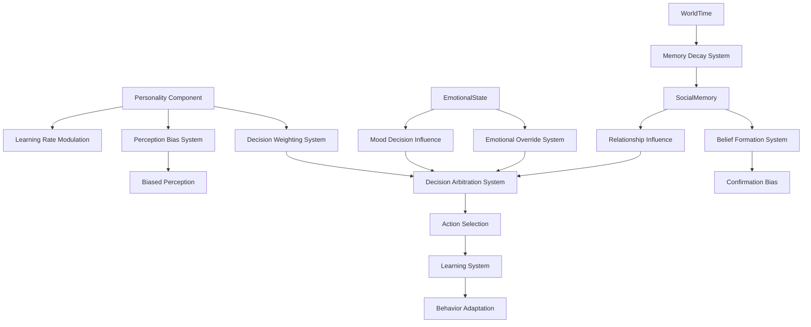

# Design Document

## Overview

The Cognitive Architecture system implements decision-making that feels authentically human through personality-driven choices, dual-process cognition, and emotionally logical (but not optimal) reasoning. This design creates NPCs that make believable mistakes, learn from experience, and maintain consistent character while supporting the "Social Turing Test" goal.

## Architecture

### Core Design Principles

1. **Dual-Process Cognition**: Fast emotional reactions (System 1) vs slow deliberative thinking (System 2)
2. **Personality-Driven Everything**: All cognitive processes modulated by Big Five traits
3. **Bounded Rationality**: Decisions are emotionally logical but not computationally optimal
4. **Memory and Learning**: Agents adapt behavior based on outcomes while maintaining personality
5. **Belief Formation**: Confirmation bias and subjective interpretation of evidence

### System Architecture Diagram



## Components and Interfaces

### Core Cognitive Components

#### Personality Component
```rust
/// Big Five personality traits that modulate all cognitive processes.
/// 
/// Each trait is represented as a value from 0.0 to 1.0, representing the agent's
/// position on the normal distribution for that trait in the population.
#[derive(Component, Debug, Reflect, Default)]
#[reflect(Component)]
pub struct Personality {
    /// Openness to experience: 0.0 = conventional, 1.0 = creative/curious
    pub openness: Normalized<f32>,
    
    /// Conscientiousness: 0.0 = impulsive, 1.0 = disciplined/organized
    pub conscientiousness: Normalized<f32>,
    
    /// Extraversion: 0.0 = introverted, 1.0 = extraverted/social
    pub extraversion: Normalized<f32>,
    
    /// Agreeableness: 0.0 = competitive, 1.0 = cooperative/trusting
    pub agreeableness: Normalized<f32>,
    
    /// Neuroticism: 0.0 = emotionally stable, 1.0 = anxious/volatile
    pub neuroticism: Normalized<f32>,
}

impl Personality {
    pub fn get_trait(&self, trait_type: PersonalityTrait) -> f32 {
        match trait_type {
            PersonalityTrait::Openness => self.openness.value(),
            PersonalityTrait::Conscientiousness => self.conscientiousness.value(),
            PersonalityTrait::Extraversion => self.extraversion.value(),
            PersonalityTrait::Agreeableness => self.agreeableness.value(),
            PersonalityTrait::Neuroticism => self.neuroticism.value(),
        }
    }
    
    /// Calculate learning rate modifier based on openness
    pub fn get_learning_rate_modifier(&self) -> f32 {
        0.5 + (self.openness.value() * 0.5) // 0.5x to 1.0x learning rate
    }
    
    /// Calculate social trust baseline based on agreeableness
    pub fn get_trust_baseline(&self) -> f32 {
        (self.agreeableness.value() - 0.5) * 0.4 // -0.2 to +0.2 trust modifier
    }
}
```

#### Decision Weighting Profile
```rust
/// Controls the balance between different decision-making processes.
/// 
/// Based on dual-process theory: System 1 (fast, emotional) vs System 2 (slow, deliberative).
/// Weights are dynamically adjusted based on stress, energy, and personality.
#[derive(Component, Debug, Reflect)]
pub struct DecisionWeightingProfile {
    /// Weight for habitual/learned responses (System 1)
    pub habitual_weight: f32,
    
    /// Weight for deliberative reasoning (System 2)
    pub deliberative_weight: f32,
    
    /// Weight for emotional/intuitive responses (System 1)
    pub emotional_weight: f32,
    
    /// Base weights before situational modulation
    pub base_weights: (f32, f32, f32),
}

impl DecisionWeightingProfile {
    pub fn new_from_personality(personality: &Personality) -> Self {
        // Conscientiousness increases deliberative weight
        let deliberative_base = 0.2 + (personality.conscientiousness.value() * 0.4);
        
        // Neuroticism increases emotional weight
        let emotional_base = 0.2 + (personality.neuroticism.value() * 0.3);
        
        // Remaining weight goes to habitual
        let habitual_base = 1.0 - deliberative_base - emotional_base;
        
        Self {
            habitual_weight: habitual_base,
            deliberative_weight: deliberative_base,
            emotional_weight: emotional_base,
            base_weights: (habitual_base, deliberative_base, emotional_base),
        }
    }
    
    pub fn apply_stress_modulation(&mut self, stress_level: f32) {
        // High stress reduces deliberative thinking
        let stress_factor = 1.0 - (stress_level * 0.6);
        self.deliberative_weight = self.base_weights.1 * stress_factor;
        
        // Redistribute weight to emotional responses
        let weight_reduction = self.base_weights.1 - self.deliberative_weight;
        self.emotional_weight = self.base_weights.2 + weight_reduction;
        
        // Normalize weights to sum to 1.0
        let total = self.habitual_weight + self.deliberative_weight + self.emotional_weight;
        self.habitual_weight /= total;
        self.deliberative_weight /= total;
        self.emotional_weight /= total;
    }
}
```

#### Belief System Component
```rust
/// Stores an agent's beliefs about other entities and the world.
/// 
/// Implements confirmation bias by weighting new evidence based on existing beliefs.
/// Beliefs are formed through observation and social interaction.
#[derive(Component, Debug, Default)]
pub struct BeliefSystem {
    /// Beliefs about other entities
    pub entity_beliefs: HashMap<Entity, EntityBelief>,
    
    /// General world beliefs and assumptions
    pub world_beliefs: HashMap<String, WorldBelief>,
}

#[derive(Debug, Clone)]
pub struct EntityBelief {
    /// What the agent believes about this entity's typical behavior
    pub behavioral_expectation: BehaviorProfile,
    
    /// Confidence in this belief (0.0 to 1.0)
    pub confidence: f32,
    
    /// When this belief was last updated
    pub last_updated: f64,
    
    /// Number of observations that formed this belief
    pub observation_count: u32,
}

#[derive(Debug, Clone)]
pub struct BehaviorProfile {
    /// Expected friendliness: -1.0 = hostile, 1.0 = friendly
    pub friendliness: f32,
    
    /// Expected trustworthiness: -1.0 = untrustworthy, 1.0 = trustworthy
    pub trustworthiness: f32,
    
    /// Expected competence: 0.0 = incompetent, 1.0 = highly competent
    pub competence: f32,
    
    /// Expected predictability: 0.0 = chaotic, 1.0 = predictable
    pub predictability: f32,
}

impl BeliefSystem {
    pub fn update_entity_belief(
        &mut self,
        entity: Entity,
        new_observation: &BehaviorProfile,
        confidence: f32,
        world_time: f64,
        personality: &Personality,
    ) {
        let belief = self.entity_beliefs.entry(entity).or_insert_with(|| EntityBelief {
            behavioral_expectation: new_observation.clone(),
            confidence: confidence * 0.5, // Start with lower confidence
            last_updated: world_time,
            observation_count: 0,
        });
        
        // Apply confirmation bias based on personality
        let openness_factor = personality.openness.value();
        let confirmation_bias_strength = 1.0 - (openness_factor * 0.3); // Less open = more biased
        
        // Weight new evidence based on how well it matches existing beliefs
        let belief_match = self.calculate_belief_match(&belief.behavioral_expectation, new_observation);
        let evidence_weight = if belief_match > 0.5 {
            confidence * (1.0 + confirmation_bias_strength * 0.5) // Confirming evidence gets more weight
        } else {
            confidence * (1.0 - confirmation_bias_strength * 0.3) // Contradicting evidence gets less weight
        };
        
        // Update belief using weighted average
        let total_weight = belief.confidence + evidence_weight;
        if total_weight > 0.0 {
            belief.behavioral_expectation = self.weighted_average_behavior(
                &belief.behavioral_expectation,
                belief.confidence,
                new_observation,
                evidence_weight,
            );
            belief.confidence = (total_weight / 2.0).min(0.95); // Never 100% certain
        }
        
        belief.last_updated = world_time;
        belief.observation_count += 1;
    }
}
```

#### Social Memory Component
```rust
/// Stores detailed history of social interactions for learning and relationship building.
/// 
/// Memory strength decays over time, with emotional memories lasting longer.
/// Used for belief formation and relationship management.
#[derive(Component, Debug, Default)]
pub struct SocialMemory {
    /// Recent interactions with other entities
    pub interactions: Vec<InteractionRecord>,
    
    /// Cached relationship summaries for quick access
    pub relationship_cache: HashMap<Entity, RelationshipSummary>,
}

#[derive(Debug, Clone)]
pub struct InteractionRecord {
    /// Who was involved in this interaction
    pub other_entity: Entity,
    
    /// When the interaction occurred (WorldTime)
    pub timestamp: f64,
    
    /// Type of interaction that occurred
    pub interaction_type: InteractionType,
    
    /// Outcome of the interaction
    pub outcome: InteractionOutcome,
    
    /// Emotional intensity during the interaction (affects memory strength)
    pub emotional_intensity: f32,
    
    /// Current strength of this memory (decays over time)
    pub memory_strength: f32,
}

#[derive(Debug, Clone)]
pub struct RelationshipSummary {
    /// Overall trust level: -1.0 = complete distrust, 1.0 = complete trust
    pub trust_level: f32,
    
    /// Emotional attachment: -1.0 = strong aversion, 1.0 = strong attachment
    pub emotional_attachment: f32,
    
    /// Perceived social status: -1.0 = much lower status, 1.0 = much higher status
    pub perceived_status: f32,
    
    /// Familiarity level: 0.0 = stranger, 1.0 = very familiar
    pub familiarity: f32,
    
    /// When this summary was last updated
    pub last_updated: f64,
}

impl SocialMemory {
    pub fn add_interaction(
        &mut self,
        other_entity: Entity,
        interaction_type: InteractionType,
        outcome: InteractionOutcome,
        emotional_intensity: f32,
        world_time: f64,
    ) {
        let record = InteractionRecord {
            other_entity,
            timestamp: world_time,
            interaction_type,
            outcome,
            emotional_intensity,
            memory_strength: 1.0,
        };
        
        self.interactions.push(record);
        
        // Update relationship cache
        self.update_relationship_summary(other_entity, &outcome, emotional_intensity, world_time);
        
        // Limit memory size for performance
        if self.interactions.len() > 1000 {
            self.interactions.retain(|record| record.memory_strength > 0.01);
        }
    }
    
    pub fn decay_memories(&mut self, world_time: f64) {
        for record in &mut self.interactions {
            let hours_elapsed = ((world_time - record.timestamp) / 3600.0) as f32;
            
            // Emotional memories decay slower
            let base_half_life = if record.emotional_intensity > 0.7 { 168.0 } else { 72.0 }; // 1 week vs 3 days
            let half_life = base_half_life * (1.0 + record.emotional_intensity);
            
            record.memory_strength *= 0.5_f32.powf(hours_elapsed / half_life);
        }
        
        // Remove very weak memories
        self.interactions.retain(|record| record.memory_strength > 0.01);
    }
}
```

## Data Models

### Action and Decision Structures

#### Action Tendencies
```rust
/// Represents an agent's current behavioral drives and priorities.
/// 
/// These tendencies are calculated from personality, current needs, and emotional state.
/// They influence which actions the agent is likely to choose.
#[derive(Component, Debug, Default)]
pub struct ActionTendencies {
    /// Drive to explore new areas and try new things
    pub exploration_drive: f32,
    
    /// Drive to seek social interaction and connection
    pub social_seeking: f32,
    
    /// Drive to focus on resource acquisition and management
    pub resource_focus: f32,
    
    /// Drive to prioritize safety and avoid risks
    pub safety_priority: f32,
    
    /// Drive to maintain and strengthen existing relationships
    pub relationship_maintenance: f32,
}

impl ActionTendencies {
    pub fn calculate_from_state(
        personality: &Personality,
        needs: &Needs,
        emotional_state: &EmotionalState,
        stress_system: &StressSystem,
    ) -> Self {
        let mut tendencies = Self::default();
        
        // Base tendencies from personality
        tendencies.exploration_drive = personality.openness.value() * 0.7 + 0.3;
        tendencies.social_seeking = personality.extraversion.value() * 0.8 + 0.2;
        tendencies.resource_focus = personality.conscientiousness.value() * 0.6 + 0.4;
        tendencies.safety_priority = personality.neuroticism.value() * 0.8 + 0.2;
        
        // Modulate by current needs
        tendencies.social_seeking += needs.social.value() * 0.5;
        tendencies.safety_priority += needs.safety.value() * 0.6;
        tendencies.resource_focus += (needs.hunger.value() + needs.energy.value()) * 0.3;
        
        // Modulate by emotional state
        if emotional_state.valence > 0.3 {
            tendencies.exploration_drive += 0.2;
            tendencies.social_seeking += 0.3;
        } else if emotional_state.valence < -0.3 {
            tendencies.safety_priority += 0.4;
            tendencies.resource_focus += 0.2;
        }
        
        // Stress increases safety priority
        tendencies.safety_priority += stress_system.acute_stress.value() * 0.5;
        
        // Normalize to prevent extreme values
        tendencies.clamp_all(0.0, 2.0);
        
        tendencies
    }
}
```

### Learning and Adaptation Structures

#### Learning System Component
```rust
/// Manages an agent's learning and behavioral adaptation over time.
/// 
/// Tracks action outcomes and adjusts decision preferences based on success/failure.
/// Learning rate is modulated by personality traits.
#[derive(Component, Debug, Default)]
pub struct LearningSystem {
    /// History of action outcomes for learning
    pub action_outcomes: Vec<ActionOutcome>,
    
    /// Learned preferences for different action types
    pub action_preferences: HashMap<ActionType, f32>,
    
    /// Learning rate modifier based on personality
    pub learning_rate: f32,
    
    /// Confidence in learned behaviors
    pub learning_confidence: f32,
}

#[derive(Debug, Clone)]
pub struct ActionOutcome {
    /// What action was taken
    pub action_type: ActionType,
    
    /// Context in which the action was taken
    pub context: ActionContext,
    
    /// How successful the action was (-1.0 to 1.0)
    pub success_rating: f32,
    
    /// Emotional state during the action
    pub emotional_context: f32,
    
    /// When this outcome occurred
    pub timestamp: f64,
    
    /// Strength of this learning experience
    pub learning_strength: f32,
}

impl LearningSystem {
    pub fn new_from_personality(personality: &Personality) -> Self {
        Self {
            action_outcomes: Vec::new(),
            action_preferences: HashMap::new(),
            learning_rate: personality.get_learning_rate_modifier(),
            learning_confidence: 0.5,
        }
    }
    
    pub fn record_outcome(
        &mut self,
        action_type: ActionType,
        context: ActionContext,
        success_rating: f32,
        emotional_intensity: f32,
        world_time: f64,
    ) {
        let outcome = ActionOutcome {
            action_type,
            context,
            success_rating,
            emotional_context: emotional_intensity,
            timestamp: world_time,
            learning_strength: 1.0 + emotional_intensity * 0.5, // Emotional experiences teach more
        };
        
        self.action_outcomes.push(outcome);
        
        // Update action preferences
        let current_preference = self.action_preferences.get(&action_type).copied().unwrap_or(0.0);
        let learning_delta = success_rating * self.learning_rate * (1.0 + emotional_intensity * 0.3);
        let new_preference = (current_preference + learning_delta).clamp(-2.0, 2.0);
        
        self.action_preferences.insert(action_type, new_preference);
        
        // Update learning confidence
        self.learning_confidence = (self.learning_confidence + 0.01).min(0.95);
        
        // Limit outcome history for performance
        if self.action_outcomes.len() > 500 {
            self.action_outcomes.retain(|outcome| {
                let age_hours = ((world_time - outcome.timestamp) / 3600.0) as f32;
                outcome.learning_strength > 0.1 && age_hours < 168.0 // Keep for 1 week max
            });
        }
    }
}
```

## Error Handling

### Cognitive Stability Monitoring

#### Decision Consistency Validation
```rust
/// Monitors decision-making patterns for consistency and stability.
/// 
/// Detects when agents make decisions that are inconsistent with their personality
/// or when decision patterns drift over time.
#[derive(Resource, Default)]
pub struct CognitiveStabilityMonitor {
    pub decision_history: HashMap<Entity, VecDeque<DecisionRecord>>,
    pub personality_consistency_scores: HashMap<Entity, f32>,
    pub stability_alerts: Vec<CognitiveAlert>,
}

#[derive(Debug, Clone)]
pub struct DecisionRecord {
    pub timestamp: f64,
    pub action_chosen: ActionType,
    pub decision_weights: (f32, f32, f32), // habitual, deliberative, emotional
    pub personality_alignment: f32,
}

#[derive(Debug)]
pub struct CognitiveAlert {
    pub entity: Entity,
    pub alert_type: CognitiveAlertType,
    pub severity: f32,
    pub description: String,
    pub timestamp: f64,
}

#[derive(Debug)]
pub enum CognitiveAlertType {
    PersonalityDrift,
    DecisionInconsistency,
    LearningStagnation,
    BeliefExtremism,
}

impl CognitiveStabilityMonitor {
    pub fn record_decision(
        &mut self,
        entity: Entity,
        decision: DecisionRecord,
        personality: &Personality,
    ) {
        let history = self.decision_history.entry(entity).or_insert_with(VecDeque::new);
        history.push_back(decision);
        
        if history.len() > 100 {
            history.pop_front();
        }
        
        // Check for personality consistency
        if history.len() >= 20 {
            let consistency_score = self.calculate_personality_consistency(history, personality);
            self.personality_consistency_scores.insert(entity, consistency_score);
            
            if consistency_score < 0.3 {
                self.stability_alerts.push(CognitiveAlert {
                    entity,
                    alert_type: CognitiveAlertType::PersonalityDrift,
                    severity: 1.0 - consistency_score,
                    description: format!("Agent decisions inconsistent with personality (score: {:.2})", consistency_score),
                    timestamp: decision.timestamp,
                });
            }
        }
    }
}
```

## Testing Strategy

### Cognitive Behavior Testing

#### Personality Consistency Tests
```rust
#[cfg(test)]
mod cognitive_tests {
    use super::*;
    
    #[test]
    fn test_personality_influences_decisions() {
        let mut app = App::new();
        app.add_plugins(MinimalPlugins)
           .add_plugins(CognitionPlugin);
        
        // Create agents with extreme personality differences
        let introverted_agent = app.world.spawn((
            Personality {
                extraversion: 0.1.into(),
                openness: 0.2.into(),
                ..default()
            },
            DecisionWeightingProfile::new_from_personality(&Personality {
                extraversion: 0.1.into(),
                openness: 0.2.into(),
                ..default()
            }),
            ActionTendencies::default(),
        )).id();
        
        let extraverted_agent = app.world.spawn((
            Personality {
                extraversion: 0.9.into(),
                openness: 0.8.into(),
                ..default()
            },
            DecisionWeightingProfile::new_from_personality(&Personality {
                extraversion: 0.9.into(),
                openness: 0.8.into(),
                ..default()
            }),
            ActionTendencies::default(),
        )).id();
        
        // Run decision systems
        app.update();
        
        // Verify personality differences create different action tendencies
        let introverted_tendencies = app.world.get::<ActionTendencies>(introverted_agent).unwrap();
        let extraverted_tendencies = app.world.get::<ActionTendencies>(extraverted_agent).unwrap();
        
        assert!(extraverted_tendencies.social_seeking > introverted_tendencies.social_seeking,
                "Extraverted agents should have higher social seeking");
        assert!(extraverted_tendencies.exploration_drive > introverted_tendencies.exploration_drive,
                "Open agents should have higher exploration drive");
    }
    
    #[test]
    fn test_learning_from_outcomes() {
        let mut learning_system = LearningSystem::new_from_personality(&Personality {
            openness: 0.8.into(),
            ..default()
        });
        
        // Record successful social interaction
        learning_system.record_outcome(
            ActionType::SocialApproach,
            ActionContext::Friendly,
            0.8, // High success
            0.6, // Moderate emotional intensity
            100.0, // Timestamp
        );
        
        // Verify preference increased
        let preference = learning_system.action_preferences.get(&ActionType::SocialApproach).unwrap();
        assert!(*preference > 0.0, "Successful actions should increase preference");
        
        // Record failed social interaction
        learning_system.record_outcome(
            ActionType::SocialApproach,
            ActionContext::Hostile,
            -0.7, // High failure
            0.9, // High emotional intensity
            200.0, // Later timestamp
        );
        
        // Verify preference adjusted based on context
        let updated_preference = learning_system.action_preferences.get(&ActionType::SocialApproach).unwrap();
        assert!(*updated_preference < *preference, "Failed actions should decrease preference");
    }
}
```

This cognitive architecture design creates agents that feel authentically human through their flawed, biased, and emotionally-driven decision making while maintaining consistent personalities and the ability to learn and adapt over time.