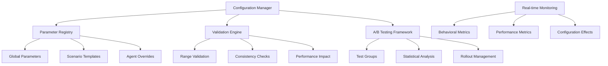

# Design Document

## Overview

The Configuration and Tuning system provides comprehensive tools for adjusting AI behavior parameters, personality distributions, and system performance settings at runtime. This design enables developers and administrators to fine-tune social dynamics, optimize performance, and adapt AI behavior to different gameplay scenarios without code changes.

## Architecture

### Core Design Principles

1. **Runtime Parameter Adjustment**: Hot-swappable configuration without simulation restart
2. **Hierarchical Configuration**: Global, scenario, and individual agent parameter control
3. **A/B Testing Framework**: Controlled experimentation with statistical validation
4. **Performance-Aware Tuning**: Configuration changes that respect performance budgets
5. **Validation and Safety**: Prevent configurations that break behavioral believability

### System Architecture Diagram



## Components and Interfaces

### Configuration Manager Resource
```rust
/// Central manager for all AI configuration parameters.
#[derive(Resource, Debug)]
pub struct ConfigurationManager {
    pub active_config: AiConfiguration,
    pub config_history: VecDeque<ConfigurationSnapshot>,
    pub validation_rules: ParameterValidationRules,
    pub active_experiments: HashMap<String, ABTestExperiment>,
    pub change_listeners: Vec<ConfigurationChangeListener>,
}

#[derive(Debug, Clone)]
pub struct AiConfiguration {
    pub global_parameters: GlobalAiParameters,
    pub personality_distribution: PersonalityDistributionConfig,
    pub performance_config: PerformanceConfiguration,
    pub environment_config: EnvironmentConfiguration,
    pub social_config: SocialDynamicsConfiguration,
}
```

### A/B Testing Framework
```rust
/// Manages controlled A/B testing experiments for AI parameter optimization.
#[derive(Debug)]
pub struct ABTestExperiment {
    pub experiment_id: String,
    pub experiment_name: String,
    pub start_time: f64,
    pub planned_duration: f32,
    pub status: ExperimentStatus,
    pub variants: HashMap<String, ConfigurationVariant>,
    pub agent_assignments: HashMap<Entity, String>,
    pub variant_metrics: HashMap<String, VariantMetrics>,
    pub analysis_results: Option<StatisticalAnalysis>,
}
```

### Real-time Configuration Monitoring
```rust
/// Monitors the effects of configuration changes on AI behavior and performance.
#[derive(Resource, Debug, Default)]
pub struct ConfigurationEffectMonitor {
    pub baseline_metrics: HashMap<String, f32>,
    pub current_metrics: HashMap<String, f32>,
    pub metric_history: HashMap<String, VecDeque<MetricSample>>,
    pub effect_alerts: Vec<ConfigurationEffectAlert>,
    pub monitoring_config: MonitoringConfiguration,
}
```

## Data Models

### Global AI Parameters
```rust
#[derive(Debug, Clone, Serialize, Deserialize)]
pub struct GlobalAiParameters {
    pub emotional_contagion_strength: f32,
    pub personality_expression_intensity: f32,
    pub decision_making_speed: f32,
    pub memory_decay_rate: f32,
    pub stress_sensitivity: f32,
    pub social_influence_radius: f32,
    pub learning_rate_base: f32,
    pub confirmation_bias_strength: f32,
}

impl Default for GlobalAiParameters {
    fn default() -> Self {
        Self {
            emotional_contagion_strength: 0.1,
            personality_expression_intensity: 0.8,
            decision_making_speed: 1.0,
            memory_decay_rate: 0.001,
            stress_sensitivity: 0.7,
            social_influence_radius: 5.0,
            learning_rate_base: 0.05,
            confirmation_bias_strength: 0.3,
        }
    }
}
```

### Personality Distribution Configuration
```rust
#[derive(Debug, Clone, Serialize, Deserialize)]
pub struct PersonalityDistributionConfig {
    pub distribution_type: DistributionType,
    pub trait_parameters: HashMap<PersonalityTrait, TraitDistribution>,
    pub correlation_matrix: Option<CorrelationMatrix>,
    pub population_diversity_target: f32,
}

#[derive(Debug, Clone, Serialize, Deserialize)]
pub struct TraitDistribution {
    pub mean: f32,
    pub std_dev: f32,
    pub min_value: f32,
    pub max_value: f32,
    pub skewness: f32,
}
```

### A/B Testing Implementation
```rust
impl ABTestExperiment {
    pub fn assign_agent_to_variant(&mut self, agent: Entity, world: &World) -> String {
        let variant_name = self.select_variant_for_agent(agent, world);
        self.agent_assignments.insert(agent, variant_name.clone());
        variant_name
    }
    
    pub fn record_behavioral_metric(&mut self, variant: &str, metric_name: &str, value: f32) {
        let metrics = self.variant_metrics.entry(variant.to_string()).or_default();
        metrics.record_metric(metric_name, value);
    }
    
    pub fn analyze_results(&mut self) -> StatisticalAnalysis {
        let mut analysis = StatisticalAnalysis::new();
        
        for (variant_name, metrics) in &self.variant_metrics {
            analysis.add_variant_data(variant_name, metrics);
        }
        
        analysis.calculate_significance();
        analysis.generate_recommendations();
        
        self.analysis_results = Some(analysis.clone());
        analysis
    }
}
```

## Error Handling

### Configuration Validation
```rust
impl ParameterValidationRules {
    pub fn validate_configuration(&self, config: &AiConfiguration) -> Result<(), ValidationError> {
        // Validate parameter ranges
        self.validate_parameter_ranges(&config.global_parameters)?;
        
        // Check for parameter conflicts
        self.validate_parameter_consistency(config)?;
        
        // Estimate performance impact
        self.validate_performance_impact(config)?;
        
        // Verify behavioral believability constraints
        self.validate_behavioral_constraints(config)?;
        
        Ok(())
    }
    
    fn validate_behavioral_constraints(&self, config: &AiConfiguration) -> Result<(), ValidationError> {
        // Ensure misunderstanding rates stay in realistic range
        let expected_misunderstanding_rate = self.estimate_misunderstanding_rate(config);
        if !(0.2..=0.4).contains(&expected_misunderstanding_rate) {
            return Err(ValidationError::BehavioralConstraint(
                format!("Configuration would result in unrealistic misunderstanding rate: {:.1}%", 
                        expected_misunderstanding_rate * 100.0)
            ));
        }
        
        Ok(())
    }
}
```

## Testing Strategy

### Configuration Testing Framework
```rust
#[cfg(test)]
mod configuration_tests {
    use super::*;
    
    #[test]
    fn test_runtime_parameter_adjustment() {
        let mut config_manager = ConfigurationManager::new();
        let mut app = create_test_app_with_agents(50);
        
        // Record baseline behavior
        let baseline_metrics = measure_behavioral_metrics(&app);
        
        // Adjust emotional contagion strength
        config_manager.update_parameter(
            "emotional_contagion_strength", 
            0.2 // Double the default value
        ).unwrap();
        
        // Apply configuration
        config_manager.apply_configuration(&mut app);
        
        // Run simulation
        for _ in 0..300 { // 5 seconds
            app.update();
        }
        
        // Measure new behavior
        let updated_metrics = measure_behavioral_metrics(&app);
        
        // Verify emotional contagion increased
        assert!(updated_metrics.emotional_spread_rate > baseline_metrics.emotional_spread_rate * 1.5);
    }
    
    #[test]
    fn test_ab_testing_framework() {
        let mut experiment = ABTestExperiment::new("contagion_test");
        experiment.add_variant("control", AiConfiguration::default());
        
        let mut high_contagion_config = AiConfiguration::default();
        high_contagion_config.global_parameters.emotional_contagion_strength = 0.2;
        experiment.add_variant("high_contagion", high_contagion_config);
        
        let mut app = create_test_app_with_agents(100);
        
        // Assign agents to variants
        let agents: Vec<Entity> = app.world.query::<Entity>().iter(&app.world).collect();
        for agent in agents {
            experiment.assign_agent_to_variant(agent, &app.world);
        }
        
        // Run experiment
        for _ in 0..1800 { // 30 seconds
            app.update();
            
            // Record metrics for each variant
            experiment.record_metrics_from_app(&app);
        }
        
        // Analyze results
        let analysis = experiment.analyze_results();
        assert!(analysis.has_significant_difference());
    }
}
```

This configuration system enables comprehensive runtime tuning while maintaining behavioral believability and performance standards.