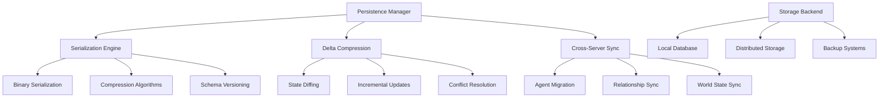

# Design Document

## Overview

The Data Persistence and Serialization system ensures efficient storage, retrieval, and synchronization of complex AI agent states, relationships, and world history across the MMORPG infrastructure. This design maintains continuity of social dynamics while supporting performance requirements and cross-server functionality.

## Architecture

### Core Design Principles

1. **Efficient Serialization**: Binary formats with compression for performance-critical data
2. **Delta Compression**: Incremental updates to minimize network and storage overhead
3. **Cross-Server Synchronization**: Seamless agent migration between game servers
4. **Temporal Consistency**: Proper handling of virtual world time in persistence
5. **Data Integrity**: Robust validation and recovery mechanisms

### System Architecture Diagram



## Components and Interfaces

### Persistence Manager Resource
```rust
/// Central manager for all AI data persistence operations.
#[derive(Resource, Debug)]
pub struct PersistenceManager {
    pub serialization_engine: SerializationEngine,
    pub delta_compressor: DeltaCompressor,
    pub cross_server_sync: CrossServerSynchronizer,
    pub storage_backend: Box<dyn StorageBackend>,
    pub active_transactions: HashMap<String, PersistenceTransaction>,
    pub performance_metrics: PersistenceMetrics,
}

impl PersistenceManager {
    pub async fn save_agent_state(&mut self, entity: Entity, world: &World) -> Result<(), PersistenceError> {
        let agent_data = self.extract_agent_data(entity, world)?;
        let serialized = self.serialization_engine.serialize_agent(&agent_data)?;
        let compressed = self.delta_compressor.compress(&serialized)?;
        
        self.storage_backend.store_agent_data(entity, compressed).await?;
        Ok(())
    }
    
    pub async fn load_agent_state(&mut self, entity: Entity, world: &mut World) -> Result<(), PersistenceError> {
        let compressed_data = self.storage_backend.load_agent_data(entity).await?;
        let serialized = self.delta_compressor.decompress(&compressed_data)?;
        let agent_data = self.serialization_engine.deserialize_agent(&serialized)?;
        
        self.restore_agent_data(entity, agent_data, world)?;
        Ok(())
    }
}
```

### Serialization Engine
```rust
/// Handles efficient serialization of AI components with schema versioning.
#[derive(Debug)]
pub struct SerializationEngine {
    pub schema_registry: SchemaRegistry,
    pub compression_config: CompressionConfig,
    pub serialization_format: SerializationFormat,
}

#[derive(Debug, Clone, Serialize, Deserialize)]
pub struct SerializedAgentData {
    pub schema_version: u32,
    pub entity_id: u64,
    pub timestamp: f64,
    pub personality_data: CompactPersonalityData,
    pub emotional_state: CompactEmotionalData,
    pub social_memory: CompressedSocialMemory,
    pub relationships: CompressedRelationships,
    pub learning_data: CompressedLearningData,
    pub checksum: u64,
}

#[derive(Debug, Clone, Serialize, Deserialize)]
pub struct CompactPersonalityData {
    pub traits: [u8; 5], // Big Five traits as u8 (0-255)
    pub stability_score: u8,
    pub development_history: Option<Vec<PersonalityChange>>,
}

impl SerializationEngine {
    pub fn serialize_agent(&self, agent_data: &AgentData) -> Result<Vec<u8>, SerializationError> {
        let compact_data = self.compress_agent_data(agent_data)?;
        let serialized = bincode::serialize(&compact_data)?;
        
        // Apply additional compression if beneficial
        if serialized.len() > 1024 {
            Ok(lz4::compress(&serialized)?)
        } else {
            Ok(serialized)
        }
    }
    
    fn compress_agent_data(&self, agent_data: &AgentData) -> Result<SerializedAgentData, SerializationError> {
        Ok(SerializedAgentData {
            schema_version: self.schema_registry.current_version(),
            entity_id: agent_data.entity.index() as u64,
            timestamp: agent_data.last_updated,
            personality_data: self.compress_personality(&agent_data.personality)?,
            emotional_state: self.compress_emotional_state(&agent_data.emotional_state)?,
            social_memory: self.compress_social_memory(&agent_data.social_memory)?,
            relationships: self.compress_relationships(&agent_data.relationships)?,
            learning_data: self.compress_learning_data(&agent_data.learning_data)?,
            checksum: self.calculate_checksum(agent_data),
        })
    }
}
```

### Delta Compression System
```rust
/// Manages incremental updates and delta compression for efficient synchronization.
#[derive(Debug)]
pub struct DeltaCompressor {
    pub state_cache: HashMap<Entity, CachedAgentState>,
    pub compression_algorithm: CompressionAlgorithm,
    pub delta_threshold: f32,
}

#[derive(Debug, Clone)]
pub struct AgentStateDelta {
    pub entity: Entity,
    pub timestamp: f64,
    pub changed_components: Vec<ComponentDelta>,
    pub relationship_changes: Vec<RelationshipDelta>,
    pub memory_changes: Vec<MemoryDelta>,
    pub delta_size: usize,
}

impl DeltaCompressor {
    pub fn calculate_delta(&mut self, entity: Entity, current_state: &AgentData) -> Option<AgentStateDelta> {
        let cached_state = self.state_cache.get(&entity)?;
        
        let mut delta = AgentStateDelta {
            entity,
            timestamp: current_state.last_updated,
            changed_components: Vec::new(),
            relationship_changes: Vec::new(),
            memory_changes: Vec::new(),
            delta_size: 0,
        };
        
        // Check personality changes
        if self.personality_changed(&cached_state.personality, &current_state.personality) {
            delta.changed_components.push(ComponentDelta::Personality(
                current_state.personality.clone()
            ));
        }
        
        // Check emotional state changes
        if self.emotional_state_changed(&cached_state.emotional_state, &current_state.emotional_state) {
            delta.changed_components.push(ComponentDelta::EmotionalState(
                current_state.emotional_state.clone()
            ));
        }
        
        // Check relationship changes
        for (other_entity, relationship) in &current_state.relationships {
            if let Some(cached_relationship) = cached_state.relationships.get(other_entity) {
                if self.relationship_changed(cached_relationship, relationship) {
                    delta.relationship_changes.push(RelationshipDelta {
                        other_entity: *other_entity,
                        new_relationship: relationship.clone(),
                        change_type: RelationshipChangeType::Modified,
                    });
                }
            } else {
                delta.relationship_changes.push(RelationshipDelta {
                    other_entity: *other_entity,
                    new_relationship: relationship.clone(),
                    change_type: RelationshipChangeType::Added,
                });
            }
        }
        
        // Calculate delta size
        delta.delta_size = self.estimate_delta_size(&delta);
        
        if delta.delta_size > 0 {
            // Update cache
            self.state_cache.insert(entity, CachedAgentState::from(current_state));
            Some(delta)
        } else {
            None
        }
    }
}
```

### Cross-Server Synchronization
```rust
/// Handles agent migration and state synchronization across game servers.
#[derive(Debug)]
pub struct CrossServerSynchronizer {
    pub server_registry: ServerRegistry,
    pub migration_queue: VecDeque<MigrationRequest>,
    pub sync_protocols: HashMap<String, Box<dyn SyncProtocol>>,
    pub conflict_resolver: ConflictResolver,
}

#[derive(Debug, Clone)]
pub struct MigrationRequest {
    pub agent_entity: Entity,
    pub source_server: ServerId,
    pub destination_server: ServerId,
    pub migration_reason: MigrationReason,
    pub priority: MigrationPriority,
    pub requested_at: f64,
}

impl CrossServerSynchronizer {
    pub async fn migrate_agent(&mut self, request: MigrationRequest) -> Result<MigrationResult, MigrationError> {
        // Extract complete agent state
        let agent_state = self.extract_complete_agent_state(request.agent_entity).await?;
        
        // Serialize for transfer
        let serialized_state = self.serialize_for_migration(&agent_state)?;
        
        // Transfer to destination server
        let transfer_result = self.transfer_agent_state(
            &request.destination_server,
            serialized_state
        ).await?;
        
        // Verify successful transfer
        self.verify_migration_integrity(&request, &transfer_result).await?;
        
        // Clean up source server state
        self.cleanup_source_agent_state(request.agent_entity).await?;
        
        Ok(MigrationResult {
            agent_entity: request.agent_entity,
            new_entity_id: transfer_result.new_entity_id,
            migration_time: transfer_result.completion_time,
            data_integrity_verified: true,
        })
    }
    
    pub async fn synchronize_relationships(&mut self, agent: Entity) -> Result<(), SyncError> {
        let relationships = self.get_agent_relationships(agent).await?;
        
        for (other_entity, relationship) in relationships {
            // Check if other entity is on a different server
            if let Some(other_server) = self.find_entity_server(other_entity).await? {
                if other_server != self.current_server_id() {
                    // Synchronize relationship state across servers
                    self.sync_cross_server_relationship(
                        agent,
                        other_entity,
                        &relationship,
                        &other_server
                    ).await?;
                }
            }
        }
        
        Ok(())
    }
}
```

## Data Models

### Storage Backend Interface
```rust
/// Trait for different storage backend implementations.
#[async_trait]
pub trait StorageBackend: Send + Sync {
    async fn store_agent_data(&mut self, entity: Entity, data: Vec<u8>) -> Result<(), StorageError>;
    async fn load_agent_data(&mut self, entity: Entity) -> Result<Vec<u8>, StorageError>;
    async fn delete_agent_data(&mut self, entity: Entity) -> Result<(), StorageError>;
    
    async fn store_world_state(&mut self, state: WorldStateSnapshot) -> Result<(), StorageError>;
    async fn load_world_state(&mut self, timestamp: f64) -> Result<WorldStateSnapshot, StorageError>;
    
    async fn create_backup(&mut self, backup_id: String) -> Result<BackupInfo, StorageError>;
    async fn restore_from_backup(&mut self, backup_id: String) -> Result<(), StorageError>;
    
    fn get_performance_metrics(&self) -> StorageMetrics;
}

/// Local database implementation for single-server scenarios.
#[derive(Debug)]
pub struct LocalDatabaseBackend {
    pub database_path: PathBuf,
    pub connection_pool: ConnectionPool,
    pub compression_enabled: bool,
    pub backup_schedule: BackupSchedule,
}

/// Distributed storage implementation for multi-server scenarios.
#[derive(Debug)]
pub struct DistributedStorageBackend {
    pub cluster_config: ClusterConfiguration,
    pub replication_factor: u32,
    pub consistency_level: ConsistencyLevel,
    pub partition_strategy: PartitionStrategy,
}
```

## Error Handling

### Data Integrity Validation
```rust
/// Validates data integrity during serialization and deserialization.
#[derive(Debug)]
pub struct DataIntegrityValidator {
    pub checksum_algorithm: ChecksumAlgorithm,
    pub validation_rules: ValidationRules,
    pub corruption_recovery: CorruptionRecovery,
}

impl DataIntegrityValidator {
    pub fn validate_agent_data(&self, data: &SerializedAgentData) -> Result<(), IntegrityError> {
        // Verify checksum
        let calculated_checksum = self.calculate_checksum(data);
        if calculated_checksum != data.checksum {
            return Err(IntegrityError::ChecksumMismatch {
                expected: data.checksum,
                calculated: calculated_checksum,
            });
        }
        
        // Validate component data ranges
        self.validate_personality_data(&data.personality_data)?;
        self.validate_emotional_data(&data.emotional_state)?;
        self.validate_relationship_data(&data.relationships)?;
        
        // Check temporal consistency
        self.validate_temporal_consistency(data)?;
        
        Ok(())
    }
    
    pub fn attempt_recovery(&self, corrupted_data: &[u8]) -> Result<SerializedAgentData, RecoveryError> {
        match self.corruption_recovery {
            CorruptionRecovery::UseBackup => self.recover_from_backup(corrupted_data),
            CorruptionRecovery::UseDefaults => self.recover_with_defaults(corrupted_data),
            CorruptionRecovery::Interpolate => self.recover_by_interpolation(corrupted_data),
        }
    }
}
```

## Testing Strategy

### Persistence Testing Framework
```rust
#[cfg(test)]
mod persistence_tests {
    use super::*;
    
    #[tokio::test]
    async fn test_agent_serialization_roundtrip() {
        let mut persistence_manager = PersistenceManager::new_with_memory_backend();
        let mut app = create_test_app_with_agents(1);
        
        let agent = app.world.spawn((
            Personality::default(),
            EmotionalState::default(),
            SocialMemory::default(),
            RelationshipComponent::default(),
        )).id();
        
        // Save agent state
        persistence_manager.save_agent_state(agent, &app.world).await.unwrap();
        
        // Modify agent state
        let mut personality = app.world.get_mut::<Personality>(agent).unwrap();
        personality.openness = 0.8.into();
        
        // Load original state
        persistence_manager.load_agent_state(agent, &mut app.world).await.unwrap();
        
        // Verify state was restored
        let restored_personality = app.world.get::<Personality>(agent).unwrap();
        assert_eq!(restored_personality.openness.value(), 0.5); // Default value
    }
    
    #[tokio::test]
    async fn test_cross_server_migration() {
        let mut source_sync = CrossServerSynchronizer::new("server_a");
        let mut dest_sync = CrossServerSynchronizer::new("server_b");
        
        let migration_request = MigrationRequest {
            agent_entity: Entity::from_raw(1),
            source_server: "server_a".into(),
            destination_server: "server_b".into(),
            migration_reason: MigrationReason::PlayerMovement,
            priority: MigrationPriority::Normal,
            requested_at: 100.0,
        };
        
        let result = source_sync.migrate_agent(migration_request).await.unwrap();
        
        assert!(result.data_integrity_verified);
        assert!(result.migration_time > 0.0);
    }
    
    #[test]
    fn test_delta_compression_efficiency() {
        let mut compressor = DeltaCompressor::new();
        
        let initial_state = create_test_agent_data();
        compressor.state_cache.insert(Entity::from_raw(1), CachedAgentState::from(&initial_state));
        
        // Make small change
        let mut modified_state = initial_state.clone();
        modified_state.emotional_state.valence = 0.6;
        
        let delta = compressor.calculate_delta(Entity::from_raw(1), &modified_state).unwrap();
        
        // Delta should be much smaller than full state
        let full_size = bincode::serialize(&modified_state).unwrap().len();
        assert!(delta.delta_size < full_size / 4); // At least 75% compression
    }
}
```

This persistence system ensures efficient, reliable storage and synchronization of complex AI states while maintaining performance and data integrity across distributed MMORPG infrastructure.