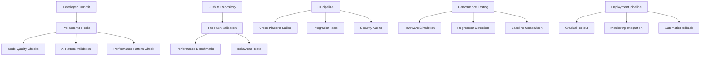

# Design Document

## Overview

The Development Infrastructure system provides comprehensive CI/CD pipelines, code quality enforcement, and development workflow automation to maintain the "Feel Over Science" philosophy while ensuring production-ready code quality. This design prevents regressions in both performance and behavioral believability through automated validation.

## Architecture

### Core Design Principles

1. **Quality Gates**: Multi-layered validation preventing low-quality code from entering the repository
2. **Behavioral Validation**: Automated testing of AI believability and social dynamics
3. **Performance Regression Prevention**: Continuous monitoring of 60fps targets on standardized hardware
4. **Architecture Enforcement**: Automated validation of ECS patterns and domain separation
5. **Comprehensive Monitoring**: Real-time tracking of code quality, performance, and behavioral metrics

### System Architecture Diagram



## Components and Interfaces

### Pre-Commit Validation System
```rust
/// Validates code quality and patterns before commits are allowed.
#[derive(Debug)]
pub struct PreCommitValidator {
    pub pattern_validators: Vec<Box<dyn PatternValidator>>,
    pub performance_checkers: Vec<Box<dyn PerformanceChecker>>,
    pub code_quality_rules: CodeQualityRules,
    pub validation_config: ValidationConfiguration,
}

/// Validates AI-specific coding patterns and conventions.
#[derive(Debug)]
pub struct AiPatternValidator {
    pub value_range_checker: ValueRangeChecker,
    pub personality_modulation_checker: PersonalityModulationChecker,
    pub temporal_consistency_checker: TemporalConsistencyChecker,
    pub event_architecture_checker: EventArchitectureChecker,
}

impl AiPatternValidator {
    pub fn validate_file(&self, file_path: &Path, content: &str) -> ValidationResult {
        let mut issues = Vec::new();
        
        // Check value ranges for AI components
        if let Some(range_issues) = self.value_range_checker.check_ranges(content) {
            issues.extend(range_issues);
        }
        
        // Verify personality modulation in AI systems
        if file_path.to_string_lossy().contains("src/ai/") {
            if let Some(modulation_issues) = self.personality_modulation_checker.check_modulation(content) {
                issues.extend(modulation_issues);
            }
        }
        
        // Check temporal consistency
        if let Some(temporal_issues) = self.temporal_consistency_checker.check_time_usage(content) {
            issues.extend(temporal_issues);
        }
        
        // Validate event-driven architecture
        if let Some(architecture_issues) = self.event_architecture_checker.check_architecture(content) {
            issues.extend(architecture_issues);
        }
        
        ValidationResult {
            file_path: file_path.to_path_buf(),
            passed: issues.is_empty(),
            issues,
            suggestions: self.generate_suggestions(&issues),
        }
    }
}
```

### Performance Testing Infrastructure
```rust
/// Manages performance testing on simulated hardware configurations.
#[derive(Debug)]
pub struct PerformanceTestingInfrastructure {
    pub hardware_simulator: HardwareSimulator,
    pub benchmark_suite: BenchmarkSuite,
    pub regression_detector: RegressionDetector,
    pub baseline_manager: BaselineManager,
}

#[derive(Debug)]
pub struct HardwareSimulator {
    pub cpu_limit: CpuLimit,
    pub memory_limit: MemoryLimit,
    pub disk_io_limit: DiskIoLimit,
    pub network_latency: NetworkLatency,
}

impl HardwareSimulator {
    pub fn simulate_medium_low_hardware(&mut self) {
        self.cpu_limit = CpuLimit::Cores(2);
        self.memory_limit = MemoryLimit::Gigabytes(4);
        self.disk_io_limit = DiskIoLimit::MegabytesPerSecond(50);
        self.network_latency = NetworkLatency::Milliseconds(50);
    }
    
    pub fn apply_constraints(&self) -> Result<(), SimulationError> {
        // Apply CPU constraints using cgroups or similar
        self.apply_cpu_constraints()?;
        
        // Apply memory constraints
        self.apply_memory_constraints()?;
        
        // Apply I/O constraints
        self.apply_io_constraints()?;
        
        Ok(())
    }
}

#[derive(Debug)]
pub struct BenchmarkSuite {
    pub performance_tests: Vec<PerformanceTest>,
    pub behavioral_tests: Vec<BehavioralTest>,
    pub integration_tests: Vec<IntegrationTest>,
    pub stress_tests: Vec<StressTest>,
}

impl BenchmarkSuite {
    pub async fn run_full_suite(&mut self) -> BenchmarkResults {
        let mut results = BenchmarkResults::new();
        
        // Run performance tests
        for test in &mut self.performance_tests {
            let result = test.run().await;
            results.performance_results.push(result);
        }
        
        // Run behavioral validation tests
        for test in &mut self.behavioral_tests {
            let result = test.run().await;
            results.behavioral_results.push(result);
        }
        
        // Run integration tests
        for test in &mut self.integration_tests {
            let result = test.run().await;
            results.integration_results.push(result);
        }
        
        // Run stress tests
        for test in &mut self.stress_tests {
            let result = test.run().await;
            results.stress_results.push(result);
        }
        
        results.calculate_overall_score();
        results
    }
}
```

### Behavioral Validation Pipeline
```rust
/// Validates that AI behavior remains believable and consistent with project philosophy.
#[derive(Debug)]
pub struct BehavioralValidationPipeline {
    pub personality_consistency_validator: PersonalityConsistencyValidator,
    pub social_dynamics_validator: SocialDynamicsValidator,
    pub misunderstanding_rate_validator: MisunderstandingRateValidator,
    pub emotional_logic_validator: EmotionalLogicValidator,
}

impl BehavioralValidationPipeline {
    pub async fn validate_behavioral_changes(&mut self, code_changes: &CodeChanges) -> BehavioralValidationResult {
        let mut validation_result = BehavioralValidationResult::new();
        
        // Test personality consistency
        if code_changes.affects_personality_systems() {
            let personality_result = self.personality_consistency_validator.validate().await;
            validation_result.personality_consistency = Some(personality_result);
        }
        
        // Test social dynamics
        if code_changes.affects_social_systems() {
            let social_result = self.social_dynamics_validator.validate().await;
            validation_result.social_dynamics = Some(social_result);
        }
        
        // Test misunderstanding rates
        if code_changes.affects_communication_pipeline() {
            let misunderstanding_result = self.misunderstanding_rate_validator.validate().await;
            validation_result.misunderstanding_rates = Some(misunderstanding_result);
        }
        
        // Test emotional logic
        if code_changes.affects_emotional_systems() {
            let emotional_result = self.emotional_logic_validator.validate().await;
            validation_result.emotional_logic = Some(emotional_result);
        }
        
        validation_result.calculate_overall_score();
        validation_result
    }
}

#[derive(Debug)]
pub struct MisunderstandingRateValidator {
    pub target_rate_range: (f32, f32), // 20-40% target
    pub test_scenarios: Vec<CommunicationScenario>,
    pub sample_size: usize,
}

impl MisunderstandingRateValidator {
    pub async fn validate(&mut self) -> ValidationResult {
        let mut total_communications = 0;
        let mut total_misunderstandings = 0;
        
        for scenario in &self.test_scenarios {
            let scenario_result = self.run_communication_scenario(scenario).await;
            total_communications += scenario_result.communication_attempts;
            total_misunderstandings += scenario_result.misunderstandings;
        }
        
        let misunderstanding_rate = total_misunderstandings as f32 / total_communications as f32;
        let in_target_range = self.target_rate_range.0 <= misunderstanding_rate && 
                             misunderstanding_rate <= self.target_rate_range.1;
        
        ValidationResult {
            test_name: "Misunderstanding Rate Validation".to_string(),
            passed: in_target_range,
            score: if in_target_range { 1.0 } else { 0.0 },
            details: format!(
                "Misunderstanding rate: {:.1}% (target: {:.1}%-{:.1}%)",
                misunderstanding_rate * 100.0,
                self.target_rate_range.0 * 100.0,
                self.target_rate_range.1 * 100.0
            ),
            metrics: vec![
                ("misunderstanding_rate".to_string(), misunderstanding_rate),
                ("total_communications".to_string(), total_communications as f32),
                ("total_misunderstandings".to_string(), total_misunderstandings as f32),
            ],
        }
    }
}
```

### CI/CD Pipeline Configuration
```rust
/// Manages the complete CI/CD pipeline configuration and execution.
#[derive(Debug)]
pub struct CiCdPipeline {
    pub stages: Vec<PipelineStage>,
    pub parallel_execution: bool,
    pub failure_handling: FailureHandling,
    pub notification_config: NotificationConfiguration,
}

#[derive(Debug)]
pub enum PipelineStage {
    CodeQuality {
        validators: Vec<String>,
        required: bool,
    },
    UnitTests {
        test_suites: Vec<String>,
        coverage_threshold: f32,
    },
    BehavioralValidation {
        test_scenarios: Vec<String>,
        acceptance_threshold: f32,
    },
    PerformanceTests {
        hardware_configs: Vec<HardwareConfig>,
        performance_targets: PerformanceTargets,
    },
    SecurityAudit {
        audit_tools: Vec<String>,
        vulnerability_threshold: VulnerabilityLevel,
    },
    CrossPlatformBuild {
        target_platforms: Vec<Platform>,
        build_configurations: Vec<BuildConfig>,
    },
    Deployment {
        deployment_strategy: DeploymentStrategy,
        rollback_conditions: Vec<RollbackCondition>,
    },
}

impl CiCdPipeline {
    pub async fn execute(&mut self, commit_info: &CommitInfo) -> PipelineResult {
        let mut pipeline_result = PipelineResult::new(commit_info.clone());
        
        for (stage_index, stage) in self.stages.iter().enumerate() {
            let stage_result = self.execute_stage(stage, &pipeline_result).await;
            pipeline_result.stage_results.push(stage_result.clone());
            
            if !stage_result.passed && stage.is_required() {
                pipeline_result.overall_status = PipelineStatus::Failed;
                pipeline_result.failure_stage = Some(stage_index);
                break;
            }
        }
        
        if pipeline_result.overall_status != PipelineStatus::Failed {
            pipeline_result.overall_status = PipelineStatus::Passed;
        }
        
        // Send notifications
        self.send_notifications(&pipeline_result).await;
        
        pipeline_result
    }
    
    async fn execute_stage(&self, stage: &PipelineStage, context: &PipelineResult) -> StageResult {
        match stage {
            PipelineStage::BehavioralValidation { test_scenarios, acceptance_threshold } => {
                let mut behavioral_pipeline = BehavioralValidationPipeline::new();
                let code_changes = CodeChanges::from_commit(&context.commit_info);
                let validation_result = behavioral_pipeline.validate_behavioral_changes(&code_changes).await;
                
                StageResult {
                    stage_name: "Behavioral Validation".to_string(),
                    passed: validation_result.overall_score >= *acceptance_threshold,
                    execution_time: validation_result.execution_time,
                    details: validation_result.details,
                    artifacts: validation_result.artifacts,
                }
            },
            PipelineStage::PerformanceTests { hardware_configs, performance_targets } => {
                let mut performance_infrastructure = PerformanceTestingInfrastructure::new();
                
                let mut all_passed = true;
                let mut combined_results = Vec::new();
                
                for hardware_config in hardware_configs {
                    performance_infrastructure.hardware_simulator.apply_config(hardware_config);
                    let benchmark_results = performance_infrastructure.benchmark_suite.run_full_suite().await;
                    
                    let meets_targets = benchmark_results.meets_performance_targets(performance_targets);
                    all_passed &= meets_targets;
                    combined_results.push(benchmark_results);
                }
                
                StageResult {
                    stage_name: "Performance Tests".to_string(),
                    passed: all_passed,
                    execution_time: combined_results.iter().map(|r| r.total_time).sum(),
                    details: format!("Tested {} hardware configurations", hardware_configs.len()),
                    artifacts: combined_results.into_iter().map(|r| r.into_artifact()).collect(),
                }
            },
            // ... other stage implementations
            _ => StageResult::default(),
        }
    }
}
```

## Data Models

### Code Quality Metrics
```rust
#[derive(Debug, Clone, Serialize, Deserialize)]
pub struct CodeQualityMetrics {
    pub cyclomatic_complexity: f32,
    pub test_coverage: f32,
    pub code_duplication: f32,
    pub maintainability_index: f32,
    pub technical_debt_ratio: f32,
    pub ai_pattern_compliance: f32,
    pub performance_pattern_compliance: f32,
}

#[derive(Debug, Clone, Serialize, Deserialize)]
pub struct PerformanceTargets {
    pub target_fps: f32,
    pub max_frame_time_ms: f32,
    pub max_memory_usage_mb: f32,
    pub max_cpu_usage_percent: f32,
    pub agent_count_target: usize,
    pub time_scale_support: f32,
}

#[derive(Debug, Clone)]
pub struct BehavioralMetrics {
    pub personality_consistency_score: f32,
    pub misunderstanding_rate: f32,
    pub emotional_logic_score: f32,
    pub social_dynamics_score: f32,
    pub relationship_formation_rate: f32,
    pub conflict_generation_rate: f32,
}
```

### Monitoring and Alerting
```rust
/// Integrates with monitoring systems to track production AI behavior quality.
#[derive(Debug)]
pub struct ProductionMonitoringIntegration {
    pub behavioral_quality_monitors: Vec<Box<dyn BehavioralQualityMonitor>>,
    pub performance_monitors: Vec<Box<dyn PerformanceMonitor>>,
    pub alert_managers: Vec<Box<dyn AlertManager>>,
    pub dashboard_integrations: Vec<Box<dyn DashboardIntegration>>,
}

impl ProductionMonitoringIntegration {
    pub async fn setup_monitoring(&mut self, deployment_info: &DeploymentInfo) -> Result<(), MonitoringError> {
        // Set up behavioral quality monitoring
        for monitor in &mut self.behavioral_quality_monitors {
            monitor.configure_for_deployment(deployment_info).await?;
            monitor.start_monitoring().await?;
        }
        
        // Set up performance monitoring
        for monitor in &mut self.performance_monitors {
            monitor.configure_performance_targets(&deployment_info.performance_targets).await?;
            monitor.start_monitoring().await?;
        }
        
        // Configure alerting
        for alert_manager in &mut self.alert_managers {
            alert_manager.configure_alert_rules(&deployment_info.alert_rules).await?;
        }
        
        Ok(())
    }
    
    pub async fn check_deployment_health(&self) -> DeploymentHealthStatus {
        let mut health_status = DeploymentHealthStatus::new();
        
        // Check behavioral quality
        for monitor in &self.behavioral_quality_monitors {
            let quality_metrics = monitor.get_current_metrics().await;
            health_status.behavioral_quality.push(quality_metrics);
        }
        
        // Check performance
        for monitor in &self.performance_monitors {
            let performance_metrics = monitor.get_current_metrics().await;
            health_status.performance_metrics.push(performance_metrics);
        }
        
        health_status.calculate_overall_health();
        health_status
    }
}
```

## Error Handling

### Deployment Rollback System
```rust
/// Manages automatic rollback when deployments fail quality or performance checks.
#[derive(Debug)]
pub struct DeploymentRollbackSystem {
    pub rollback_conditions: Vec<RollbackCondition>,
    pub rollback_strategies: HashMap<RollbackTrigger, RollbackStrategy>,
    pub health_checkers: Vec<Box<dyn HealthChecker>>,
    pub rollback_history: Vec<RollbackEvent>,
}

#[derive(Debug, Clone)]
pub enum RollbackCondition {
    PerformanceRegression { threshold: f32 },
    BehavioralQualityDrop { threshold: f32 },
    ErrorRateIncrease { threshold: f32 },
    UserComplaintSpike { threshold: u32 },
    SystemInstability,
}

impl DeploymentRollbackSystem {
    pub async fn monitor_deployment(&mut self, deployment_id: &str) -> Result<(), RollbackError> {
        let monitoring_duration = Duration::from_secs(300); // 5 minutes
        let check_interval = Duration::from_secs(30);
        
        let start_time = Instant::now();
        
        while start_time.elapsed() < monitoring_duration {
            // Check all health conditions
            for condition in &self.rollback_conditions {
                if self.check_rollback_condition(condition, deployment_id).await? {
                    // Trigger rollback
                    let rollback_strategy = self.rollback_strategies
                        .get(&RollbackTrigger::from(condition))
                        .unwrap_or(&RollbackStrategy::ImmediateRollback);
                    
                    self.execute_rollback(deployment_id, rollback_strategy).await?;
                    
                    return Ok(());
                }
            }
            
            tokio::time::sleep(check_interval).await;
        }
        
        Ok(())
    }
    
    async fn execute_rollback(&mut self, deployment_id: &str, strategy: &RollbackStrategy) -> Result<(), RollbackError> {
        let rollback_event = RollbackEvent {
            deployment_id: deployment_id.to_string(),
            trigger_time: Utc::now(),
            strategy: strategy.clone(),
            reason: "Automated rollback due to quality/performance degradation".to_string(),
        };
        
        match strategy {
            RollbackStrategy::ImmediateRollback => {
                self.perform_immediate_rollback(deployment_id).await?;
            },
            RollbackStrategy::GradualRollback { percentage_per_minute } => {
                self.perform_gradual_rollback(deployment_id, *percentage_per_minute).await?;
            },
            RollbackStrategy::CanaryRollback => {
                self.perform_canary_rollback(deployment_id).await?;
            },
        }
        
        self.rollback_history.push(rollback_event);
        Ok(())
    }
}
```

## Testing Strategy

### Infrastructure Testing Framework
```rust
#[cfg(test)]
mod infrastructure_tests {
    use super::*;
    
    #[tokio::test]
    async fn test_behavioral_validation_pipeline() {
        let mut pipeline = BehavioralValidationPipeline::new();
        
        // Create code changes that affect social systems
        let code_changes = CodeChanges {
            modified_files: vec![
                "src/ai/social/communication.rs".to_string(),
                "src/ai/social/relationships.rs".to_string(),
            ],
            change_type: ChangeType::SocialSystemModification,
        };
        
        let validation_result = pipeline.validate_behavioral_changes(&code_changes).await;
        
        assert!(validation_result.social_dynamics.is_some());
        assert!(validation_result.misunderstanding_rates.is_some());
        assert!(validation_result.overall_score >= 0.7); // Minimum acceptable score
    }
    
    #[tokio::test]
    async fn test_performance_regression_detection() {
        let mut infrastructure = PerformanceTestingInfrastructure::new();
        infrastructure.hardware_simulator.simulate_medium_low_hardware();
        
        // Run baseline performance test
        let baseline_results = infrastructure.benchmark_suite.run_full_suite().await;
        infrastructure.baseline_manager.set_baseline(baseline_results.clone());
        
        // Simulate performance regression
        let mut regressed_results = baseline_results.clone();
        regressed_results.average_fps *= 0.8; // 20% performance drop
        
        let regression_detected = infrastructure.regression_detector
            .detect_regression(&baseline_results, &regressed_results);
        
        assert!(regression_detected.is_some());
        assert!(regression_detected.unwrap().severity > 0.15); // Significant regression
    }
    
    #[test]
    fn test_ai_pattern_validation() {
        let validator = AiPatternValidator::new();
        
        // Test code with incorrect value ranges
        let bad_code = r#"
            pub struct EmotionalState {
                pub valence: f32, // Should be -1.0 to 1.0 but no documentation
            }
        "#;
        
        let result = validator.validate_file(Path::new("test.rs"), bad_code);
        assert!(!result.passed);
        assert!(result.issues.iter().any(|issue| issue.issue_type == IssueType::MissingValueRangeDocumentation));
        
        // Test code with correct patterns
        let good_code = r#"
            /// Emotional state with proper value ranges
            pub struct EmotionalState {
                /// Valence: -1.0 (displeasure) to 1.0 (pleasure)
                pub valence: f32,
            }
        "#;
        
        let result = validator.validate_file(Path::new("test.rs"), good_code);
        assert!(result.passed);
    }
}
```

This development infrastructure design ensures comprehensive quality control while maintaining the project's focus on behavioral believability and performance excellence.