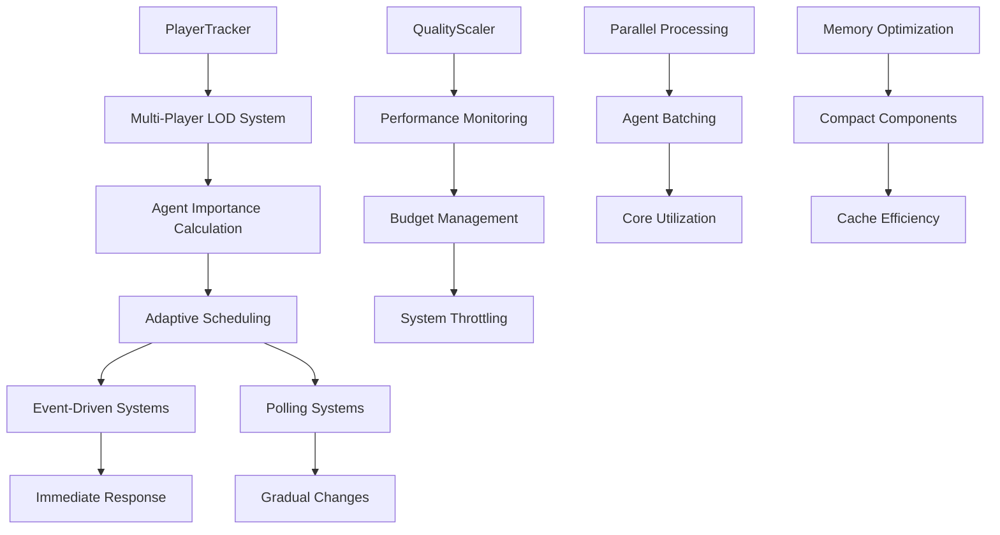

# Design Document

## Overview

The Performance Optimization system ensures the Artificial Society simulation maintains 60fps with 100+ agents through strategic memory optimization, parallel processing, adaptive quality scaling, and multi-player level-of-detail systems. This design prioritizes the "Feel Over Precision" philosophy by using the minimum computational cost that maintains behavioral believability.

## Architecture

### Core Design Principles

1. **Memory Efficiency**: Compact data types and cache-friendly layouts
2. **Event-Driven vs Polling**: Optimal update patterns for different system types
3. **Parallel Processing**: Multi-core utilization for independent agent operations
4. **Adaptive Quality Scaling**: Dynamic performance adjustment based on load
5. **Multi-Player LOD**: Importance calculation based on ALL players in the world

### System Architecture Diagram



## Components and Interfaces

### Multi-Player Level of Detail System

#### Player Tracker Resource
```rust
/// Tracks all active players for multi-player LOD calculations.
/// 
/// Maintains player positions, clusters, and importance zones to ensure
/// computational resources are allocated efficiently across the entire world.
#[derive(Resource, Debug)]
pub struct PlayerTracker {
    /// All currently active players
    pub active_players: HashMap<Entity, PlayerInfo>,
    
    /// Clustered groups of nearby players
    pub player_clusters: Vec<PlayerCluster>,
    
    /// Spatial grid for efficient LOD calculations
    pub lod_grid: LodGrid,
    
    /// Performance metrics per region
    pub regional_performance: HashMap<IVec2, RegionPerformance>,
}

#[derive(Debug, Clone)]
pub struct PlayerInfo {
    pub entity: Entity,
    pub position: Vec3,
    pub last_update: f64,
    pub view_distance: f32,
    pub importance_radius: f32,
    pub computational_priority: f32,
}

#[derive(Debug, Clone)]
pub struct PlayerCluster {
    pub center: Vec3,
    pub radius: f32,
    pub player_count: usize,
    pub combined_importance: f32,
    pub computational_budget: f32,
}

impl PlayerTracker {
    pub fn calculate_agent_importance(&self, agent_pos: Vec3) -> ImportanceLevel {
        let mut min_distance = f32::INFINITY;
        let mut affecting_players = 0;
        
        // Check distance to ALL players
        for player_info in self.active_players.values() {
            let distance = agent_pos.distance(player_info.position);
            min_distance = min_distance.min(distance);
            
            if distance < player_info.importance_radius {
                affecting_players += 1;
            }
        }
        
        // Multiple players increase importance
        let importance_multiplier = 1.0 + (affecting_players as f32 * 0.2);
        let effective_distance = min_distance / importance_multiplier;
        
        match effective_distance {
            d if d < 50.0 => ImportanceLevel::Critical,
            d if d < 150.0 => ImportanceLevel::High,
            d if d < 500.0 => ImportanceLevel::Medium,
            d if d < 1000.0 => ImportanceLevel::Low,
            _ => ImportanceLevel::Dormant,
        }
    }
}
```

#### Agent Importance Component
```rust
/// Tracks an agent's importance level for performance optimization.
/// 
/// Importance is calculated based on distance to nearest player and affects
/// update frequency, processing quality, and computational budget allocation.
#[derive(Component, Debug)]
pub struct AgentImportance {
    pub level: ImportanceLevel,
    pub distance_to_nearest_player: f32,
    pub affecting_players: Vec<Entity>,
    pub last_importance_update: f64,
    pub computational_budget: f32,
}

#[derive(Debug, Clone, Copy, PartialEq, Eq, Hash)]
pub enum ImportanceLevel {
    Critical,   // 0-50m from any player - Full processing, 10 updates/second
    High,       // 50-150m from any player - High quality, 2 updates/second
    Medium,     // 150-500m from any player - Medium quality, 0.5 updates/second
    Low,        // 500m+ from all players - Background sim, 0.1 updates/second
    Dormant,    // No players in region - Minimal processing, 0.017 updates/second
}

impl ImportanceLevel {
    pub fn get_update_frequency(&self) -> f32 {
        match self {
            ImportanceLevel::Critical => 0.1,   // 10 times per second
            ImportanceLevel::High => 0.5,       // 2 times per second
            ImportanceLevel::Medium => 2.0,     // Every 2 seconds
            ImportanceLevel::Low => 10.0,       // Every 10 seconds
            ImportanceLevel::Dormant => 60.0,   // Every minute
        }
    }
    
    pub fn get_computational_budget(&self) -> f32 {
        match self {
            ImportanceLevel::Critical => 1.0,   // Full budget
            ImportanceLevel::High => 0.7,       // 70% budget
            ImportanceLevel::Medium => 0.4,     // 40% budget
            ImportanceLevel::Low => 0.2,        // 20% budget
            ImportanceLevel::Dormant => 0.05,   // 5% budget
        }
    }
}
```

### Memory Optimization Components

#### Compact Personality Component
```rust
/// Memory-optimized personality storage using u8 values.
/// 
/// Stores Big Five traits in 5 bytes instead of 20 bytes (75% memory savings).
/// Values are converted to f32 for calculations when needed.
#[derive(Component, Debug, Reflect)]
#[reflect(Component)]
pub struct PersonalityCompact {
    /// Openness: 0-255 mapped to 0.0-1.0
    pub openness: u8,
    
    /// Conscientiousness: 0-255 mapped to 0.0-1.0
    pub conscientiousness: u8,
    
    /// Extraversion: 0-255 mapped to 0.0-1.0
    pub extraversion: u8,
    
    /// Agreeableness: 0-255 mapped to 0.0-1.0
    pub agreeableness: u8,
    
    /// Neuroticism: 0-255 mapped to 0.0-1.0
    pub neuroticism: u8,
}

impl PersonalityCompact {
    pub fn openness_f32(&self) -> f32 {
        self.openness as f32 / 255.0
    }
    
    pub fn set_openness(&mut self, value: f32) {
        self.openness = (value.clamp(0.0, 1.0) * 255.0) as u8;
    }
    
    pub fn get_trait(&self, trait_type: PersonalityTrait) -> f32 {
        match trait_type {
            PersonalityTrait::Openness => self.openness_f32(),
            PersonalityTrait::Conscientiousness => self.conscientiousness as f32 / 255.0,
            PersonalityTrait::Extraversion => self.extraversion as f32 / 255.0,
            PersonalityTrait::Agreeableness => self.agreeableness as f32 / 255.0,
            PersonalityTrait::Neuroticism => self.neuroticism as f32 / 255.0,
        }
    }
}
```

#### Compact Emotional State Component
```rust
/// Memory-optimized emotional state using i16 values.
/// 
/// Stores PAD dimensions in 6 bytes instead of 12 bytes (50% memory savings).
/// Maintains -1.0 to 1.0 range with sufficient precision for believable behavior.
#[derive(Component, Debug, Reflect)]
#[reflect(Component)]
pub struct EmotionalStateCompact {
    /// Valence: -32768 to 32767 mapped to -1.0 to 1.0
    pub valence: i16,
    
    /// Arousal: -32768 to 32767 mapped to -1.0 to 1.0
    pub arousal: i16,
    
    /// Dominance: -32768 to 32767 mapped to -1.0 to 1.0
    pub dominance: i16,
}

impl EmotionalStateCompact {
    pub fn valence_f32(&self) -> f32 {
        self.valence as f32 / 32767.0
    }
    
    pub fn set_valence(&mut self, value: f32) {
        self.valence = (value.clamp(-1.0, 1.0) * 32767.0) as i16;
    }
    
    pub fn get_emotional_intensity(&self) -> f32 {
        let v = self.valence_f32().abs();
        let a = (self.arousal as f32 / 32767.0).abs();
        let d = (self.dominance as f32 / 32767.0).abs();
        (v + a + d) / 3.0
    }
}
```

### Performance Monitoring and Scaling

#### Quality Scaler Resource
```rust
/// Manages adaptive quality scaling based on performance metrics.
/// 
/// Automatically reduces computational quality when performance drops below
/// target thresholds, ensuring stable frame rates under varying loads.
#[derive(Resource, Debug)]
pub struct QualityScaler {
    pub target_fps: f32,
    pub current_fps: f32,
    pub quality_level: f32,        // 0.1 to 1.0
    pub frame_time_history: VecDeque<f32>,
    pub performance_trend: f32,    // -1.0 = degrading, 1.0 = improving
    pub last_adjustment: f64,
}

impl QualityScaler {
    pub fn update(&mut self, frame_time: f32, world_time: f64) {
        self.current_fps = 1.0 / frame_time;
        self.frame_time_history.push_back(frame_time);
        
        if self.frame_time_history.len() > 60 {
            self.frame_time_history.pop_front();
        }
        
        // Calculate performance trend
        if self.frame_time_history.len() >= 30 {
            let recent_avg: f32 = self.frame_time_history.iter().rev().take(15).sum::<f32>() / 15.0;
            let older_avg: f32 = self.frame_time_history.iter().rev().skip(15).take(15).sum::<f32>() / 15.0;
            self.performance_trend = (older_avg - recent_avg) / older_avg; // Positive = improving
        }
        
        // Adjust quality level
        let target_frame_time = 1.0 / self.target_fps;
        let performance_ratio = frame_time / target_frame_time;
        
        if performance_ratio > 1.1 && world_time - self.last_adjustment > 1.0 {
            // Performance below target, reduce quality
            self.quality_level = (self.quality_level - 0.1).max(0.1);
            self.last_adjustment = world_time;
        } else if performance_ratio < 0.9 && self.performance_trend > 0.05 && world_time - self.last_adjustment > 2.0 {
            // Performance above target and improving, increase quality
            self.quality_level = (self.quality_level + 0.05).min(1.0);
            self.last_adjustment = world_time;
        }
    }
    
    pub fn get_update_frequency_multiplier(&self) -> f32 {
        0.5 + (self.quality_level * 0.5) // 0.5x to 1.0x frequency
    }
    
    pub fn should_skip_expensive_calculation(&self) -> bool {
        self.quality_level < 0.5
    }
}
```

#### System Profiler Resource
```rust
/// Tracks performance metrics for individual systems and overall simulation.
/// 
/// Provides detailed timing information and identifies performance bottlenecks
/// for optimization and debugging purposes.
#[derive(Resource, Debug, Default)]
pub struct SystemProfiler {
    pub system_times: HashMap<String, SystemMetrics>,
    pub frame_budget: f32,
    pub current_frame_time: f32,
    pub budget_violations: Vec<BudgetViolation>,
}

#[derive(Debug, Clone)]
pub struct SystemMetrics {
    pub recent_times: VecDeque<f32>,
    pub average_time: f32,
    pub max_time: f32,
    pub budget_allocation: f32,
    pub utilization_ratio: f32,
}

#[derive(Debug)]
pub struct BudgetViolation {
    pub system_name: String,
    pub allocated_budget: f32,
    pub actual_time: f32,
    pub violation_ratio: f32,
    pub timestamp: f64,
}

impl SystemProfiler {
    pub fn record_system_time(&mut self, system_name: &str, execution_time: f32) {
        let metrics = self.system_times.entry(system_name.to_string()).or_insert_with(|| SystemMetrics {
            recent_times: VecDeque::new(),
            average_time: 0.0,
            max_time: 0.0,
            budget_allocation: self.frame_budget * 0.1, // Default 10% budget
            utilization_ratio: 0.0,
        });
        
        metrics.recent_times.push_back(execution_time);
        if metrics.recent_times.len() > 60 {
            metrics.recent_times.pop_front();
        }
        
        metrics.average_time = metrics.recent_times.iter().sum::<f32>() / metrics.recent_times.len() as f32;
        metrics.max_time = metrics.max_time.max(execution_time);
        metrics.utilization_ratio = metrics.average_time / metrics.budget_allocation;
        
        // Check for budget violations
        if execution_time > metrics.budget_allocation * 1.2 {
            self.budget_violations.push(BudgetViolation {
                system_name: system_name.to_string(),
                allocated_budget: metrics.budget_allocation,
                actual_time: execution_time,
                violation_ratio: execution_time / metrics.budget_allocation,
                timestamp: 0.0, // Would be filled by calling system
            });
        }
    }
    
    pub fn get_system_budget(&self, system_name: &str) -> f32 {
        self.system_times
            .get(system_name)
            .map(|m| m.budget_allocation)
            .unwrap_or(self.frame_budget * 0.05) // Default 5% budget
    }
}
```

## Data Models

### Parallel Processing Structures

#### Agent Batch Processing
```rust
/// Manages batching of agents for parallel processing.
/// 
/// Groups agents into optimal batch sizes for multi-core processing while
/// maintaining cache efficiency and load balancing.
#[derive(Resource, Debug)]
pub struct ParallelProcessingManager {
    pub optimal_batch_size: usize,
    pub available_cores: usize,
    pub current_load_distribution: Vec<f32>,
    pub processing_queues: Vec<Vec<Entity>>,
}

impl ParallelProcessingManager {
    pub fn new() -> Self {
        let available_cores = std::thread::available_parallelism()
            .map(|n| n.get())
            .unwrap_or(4);
        
        Self {
            optimal_batch_size: 32, // Tuned for cache efficiency
            available_cores,
            current_load_distribution: vec![0.0; available_cores],
            processing_queues: vec![Vec::new(); available_cores],
        }
    }
    
    pub fn distribute_agents(&mut self, agents: Vec<Entity>, importance_levels: &HashMap<Entity, ImportanceLevel>) {
        // Clear previous queues
        for queue in &mut self.processing_queues {
            queue.clear();
        }
        
        // Sort agents by importance for better load balancing
        let mut sorted_agents: Vec<_> = agents.into_iter().collect();
        sorted_agents.sort_by_key(|entity| {
            importance_levels.get(entity)
                .map(|level| match level {
                    ImportanceLevel::Critical => 4,
                    ImportanceLevel::High => 3,
                    ImportanceLevel::Medium => 2,
                    ImportanceLevel::Low => 1,
                    ImportanceLevel::Dormant => 0,
                })
                .unwrap_or(0)
        });
        
        // Distribute to queues using round-robin with load balancing
        let mut current_queue = 0;
        for agent in sorted_agents {
            self.processing_queues[current_queue].push(agent);
            
            // Move to next queue, preferring less loaded queues
            current_queue = (current_queue + 1) % self.available_cores;
        }
    }
}
```

### Memory Pool Management

#### Object Pool Resource
```rust
/// Manages object pools for frequently allocated temporary data structures.
/// 
/// Reduces garbage collection pressure and allocation overhead by reusing
/// objects for temporary calculations and data processing.
#[derive(Resource, Default)]
pub struct ObjectPoolManager {
    pub interaction_buffers: Vec<Vec<SocialInteraction>>,
    pub calculation_buffers: Vec<Vec<f32>>,
    pub entity_lists: Vec<Vec<Entity>>,
    pub string_buffers: Vec<String>,
    pub max_pool_size: usize,
}

impl ObjectPoolManager {
    pub fn new() -> Self {
        Self {
            interaction_buffers: Vec::new(),
            calculation_buffers: Vec::new(),
            entity_lists: Vec::new(),
            string_buffers: Vec::new(),
            max_pool_size: 1024,
        }
    }
    
    pub fn get_interaction_buffer(&mut self) -> Vec<SocialInteraction> {
        self.interaction_buffers.pop().unwrap_or_else(Vec::new)
    }
    
    pub fn return_interaction_buffer(&mut self, mut buffer: Vec<SocialInteraction>) {
        buffer.clear();
        if buffer.capacity() <= 1024 && self.interaction_buffers.len() < self.max_pool_size {
            self.interaction_buffers.push(buffer);
        }
    }
    
    pub fn get_calculation_buffer(&mut self) -> Vec<f32> {
        self.calculation_buffers.pop().unwrap_or_else(Vec::new)
    }
    
    pub fn return_calculation_buffer(&mut self, mut buffer: Vec<f32>) {
        buffer.clear();
        if buffer.capacity() <= 512 && self.calculation_buffers.len() < self.max_pool_size {
            self.calculation_buffers.push(buffer);
        }
    }
}
```

## Error Handling

### Performance Regression Detection

#### Performance Baseline Monitoring
```rust
/// Monitors performance baselines and detects regressions.
/// 
/// Tracks performance metrics over time and alerts when performance
/// degrades beyond acceptable thresholds.
#[derive(Resource, Debug)]
pub struct PerformanceRegressionDetector {
    pub baseline_metrics: HashMap<String, PerformanceBaseline>,
    pub regression_alerts: Vec<RegressionAlert>,
    pub monitoring_window: Duration,
}

#[derive(Debug, Clone)]
pub struct PerformanceBaseline {
    pub metric_name: String,
    pub baseline_value: f32,
    pub acceptable_variance: f32,
    pub recent_values: VecDeque<f32>,
    pub trend: f32,
}

#[derive(Debug)]
pub struct RegressionAlert {
    pub metric_name: String,
    pub baseline_value: f32,
    pub current_value: f32,
    pub regression_percentage: f32,
    pub severity: RegressionSeverity,
    pub timestamp: f64,
}

#[derive(Debug, PartialEq)]
pub enum RegressionSeverity {
    Minor,      // 5-15% regression
    Moderate,   // 15-30% regression
    Severe,     // 30%+ regression
}

impl PerformanceRegressionDetector {
    pub fn update_metric(&mut self, metric_name: &str, value: f32, world_time: f64) {
        let baseline = self.baseline_metrics.entry(metric_name.to_string()).or_insert_with(|| PerformanceBaseline {
            metric_name: metric_name.to_string(),
            baseline_value: value,
            acceptable_variance: 0.15, // 15% variance allowed
            recent_values: VecDeque::new(),
            trend: 0.0,
        });
        
        baseline.recent_values.push_back(value);
        if baseline.recent_values.len() > 100 {
            baseline.recent_values.pop_front();
        }
        
        // Calculate trend
        if baseline.recent_values.len() >= 20 {
            let recent_avg: f32 = baseline.recent_values.iter().rev().take(10).sum::<f32>() / 10.0;
            let older_avg: f32 = baseline.recent_values.iter().rev().skip(10).take(10).sum::<f32>() / 10.0;
            baseline.trend = (recent_avg - older_avg) / older_avg;
        }
        
        // Check for regression
        let regression_ratio = (value - baseline.baseline_value) / baseline.baseline_value;
        if regression_ratio > baseline.acceptable_variance {
            let severity = match regression_ratio {
                r if r > 0.3 => RegressionSeverity::Severe,
                r if r > 0.15 => RegressionSeverity::Moderate,
                _ => RegressionSeverity::Minor,
            };
            
            self.regression_alerts.push(RegressionAlert {
                metric_name: metric_name.to_string(),
                baseline_value: baseline.baseline_value,
                current_value: value,
                regression_percentage: regression_ratio * 100.0,
                severity,
                timestamp: world_time,
            });
        }
    }
}
```

## Testing Strategy

### Performance Testing Framework

#### Benchmark Suite
```rust
#[cfg(test)]
mod performance_tests {
    use super::*;
    use std::time::Instant;
    
    #[test]
    fn benchmark_agent_processing_parallel() {
        let mut app = create_test_app_with_agents(1000);
        let mut parallel_manager = ParallelProcessingManager::new();
        
        // Collect all agent entities
        let agents: Vec<Entity> = app.world
            .query::<Entity>()
            .iter(&app.world)
            .collect();
        
        let importance_levels: HashMap<Entity, ImportanceLevel> = agents
            .iter()
            .enumerate()
            .map(|(i, &entity)| {
                let level = match i % 5 {
                    0 => ImportanceLevel::Critical,
                    1 => ImportanceLevel::High,
                    2 => ImportanceLevel::Medium,
                    3 => ImportanceLevel::Low,
                    _ => ImportanceLevel::Dormant,
                };
                (entity, level)
            })
            .collect();
        
        parallel_manager.distribute_agents(agents, &importance_levels);
        
        let start = Instant::now();
        
        // Simulate parallel processing
        parallel_manager.processing_queues
            .par_iter()
            .for_each(|queue| {
                for _entity in queue {
                    // Simulate AI processing work
                    std::hint::black_box({
                        let mut sum = 0.0f32;
                        for i in 0..100 {
                            sum += (i as f32).sin();
                        }
                        sum
                    });
                }
            });
        
        let elapsed = start.elapsed();
        
        // Should process 1000 agents in reasonable time
        assert!(elapsed.as_millis() < 50, "Parallel processing too slow: {}ms", elapsed.as_millis());
    }
    
    #[test]
    fn test_memory_optimization_effectiveness() {
        // Test compact vs regular components
        let compact_size = std::mem::size_of::<PersonalityCompact>();
        let regular_size = std::mem::size_of::<Personality>();
        
        assert!(compact_size < regular_size / 2, 
                "Compact personality should be <50% of regular size");
        
        let emotional_compact_size = std::mem::size_of::<EmotionalStateCompact>();
        let emotional_regular_size = std::mem::size_of::<EmotionalState>();
        
        assert!(emotional_compact_size < emotional_regular_size / 2,
                "Compact emotional state should be <50% of regular size");
    }
    
    #[test]
    fn test_quality_scaling_response() {
        let mut quality_scaler = QualityScaler {
            target_fps: 60.0,
            current_fps: 60.0,
            quality_level: 1.0,
            frame_time_history: VecDeque::new(),
            performance_trend: 0.0,
            last_adjustment: 0.0,
        };
        
        // Simulate performance drop
        for _ in 0..20 {
            quality_scaler.update(1.0 / 45.0, 1.0); // 45 FPS
        }
        
        assert!(quality_scaler.quality_level < 1.0, 
                "Quality should decrease when performance drops");
        
        // Simulate performance recovery
        for i in 0..30 {
            quality_scaler.update(1.0 / 65.0, 2.0 + i as f64 * 0.1); // 65 FPS
        }
        
        assert!(quality_scaler.quality_level > 0.5,
                "Quality should increase when performance improves");
    }
}
```

This performance optimization design ensures the simulation can maintain 60fps with 100+ agents while providing the tools and monitoring needed to identify and resolve performance issues as the system scales.