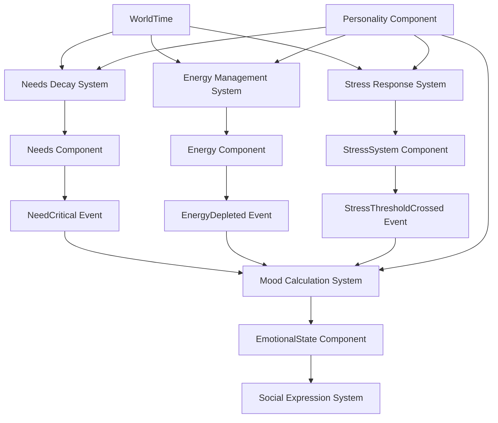

# Design Document

## Overview

The Physiological Foundation system implements the base biological simulation layer that drives all AI agent behaviors through needs, stress responses, and energy management. This design prioritizes the "Feel Over Science" philosophy by creating simple, believable physiological states that players can intuitively understand while maintaining 60fps performance with 100+ agents.

## Architecture

### Core Design Principles

1. **Continuous State Spaces**: All physiological values use 0.0-1.0 ranges for needs and stress
2. **Event-Driven Responses**: Immediate reactions to critical states through events
3. **Polling for Gradual Changes**: Time-based decay using adaptive scheduling
4. **Personality Modulation**: All systems influenced by Big Five personality traits
5. **Temporal Consistency**: All calculations use WorldTime for time scaling support

### System Architecture Diagram



## Components and Interfaces

### Core Physiological Components

#### Needs Component
```rust
/// Represents an agent's basic physiological needs that drive behavior.
/// 
/// All needs are represented as values from 0.0 (completely satisfied) to 1.0 (critically unmet).
/// When needs exceed 0.8, they trigger stress responses and behavioral changes.
#[derive(Component, Debug, Reflect, Default)]
#[reflect(Component)]
pub struct Needs {
    /// Hunger level: 0.0 = well-fed, 1.0 = starving
    pub hunger: Normalized<f32>,
    
    /// Energy level: 0.0 = exhausted, 1.0 = fully rested
    pub energy: Normalized<f32>,
    
    /// Safety need: 0.0 = feels secure, 1.0 = feels threatened
    pub safety: Normalized<f32>,
    
    /// Social connection need: 0.0 = socially fulfilled, 1.0 = lonely
    pub social: Normalized<f32>,
}

impl Needs {
    pub fn get_most_urgent(&self) -> (NeedType, f32) {
        let needs = [
            (NeedType::Hunger, self.hunger.value()),
            (NeedType::Energy, self.energy.value()),
            (NeedType::Safety, self.safety.value()),
            (NeedType::Social, self.social.value()),
        ];
        
        needs.iter()
             .max_by(|a, b| a.1.partial_cmp(&b.1).unwrap())
             .map(|(need_type, value)| (*need_type, *value))
             .unwrap_or((NeedType::Hunger, 0.0))
    }
    
    pub fn calculate_overall_distress(&self) -> f32 {
        (self.hunger.value() + self.energy.value() + 
         self.safety.value() + self.social.value()) / 4.0
    }
}
```

#### Stress System Component
```rust
/// Manages an agent's stress response system with three distinct states.
/// 
/// Based on allostatic load theory - the body's ability to adapt to stress
/// and the cumulative wear and tear from chronic stress exposure.
#[derive(Component, Debug, Reflect, Default)]
#[reflect(Component)]
pub struct StressSystem {
    /// Immediate stress response: 0.0 = calm, 1.0 = panic
    pub acute_stress: Normalized<f32>,
    
    /// Accumulated stress over time: 0.0 = fresh, 1.0 = burned out
    pub chronic_load: Normalized<f32>,
    
    /// Current stress system state
    pub state: StressState,
    
    /// Baseline reactivity modifier (affected by chronic stress)
    pub reactivity_modifier: f32,
}

#[derive(Debug, Reflect, PartialEq, Clone, Copy)]
pub enum StressState {
    /// Normal, resilient state - can handle stress effectively
    Homeostasis,
    
    /// Alert, adaptive state - heightened awareness and reactivity
    Allostasis,
    
    /// Broken, hypersensitive state - overreactive to minor stressors
    PostTraumatic,
}

impl StressSystem {
    pub fn get_decision_clarity(&self) -> f32 {
        match self.state {
            StressState::Homeostasis => 1.0 - (self.acute_stress.value() * 0.3),
            StressState::Allostasis => 1.0 - (self.acute_stress.value() * 0.5),
            StressState::PostTraumatic => 1.0 - (self.acute_stress.value() * 0.7),
        }
    }
}
```

#### Emotional State Component
```rust
/// Represents an agent's current emotional state using the PAD model.
/// 
/// Uses bipolar dimensions (-1.0 to 1.0) to represent opposing emotional states
/// with meaningful neutral points (0.0).
#[derive(Component, Debug, Reflect, Default)]
#[reflect(Component)]
pub struct EmotionalState {
    /// Pleasure/displeasure dimension: -1.0 (very unpleasant) to 1.0 (very pleasant)
    pub valence: f32,
    
    /// Activation/deactivation dimension: -1.0 (very calm) to 1.0 (very excited)
    pub arousal: f32,
    
    /// Control/submission dimension: -1.0 (very submissive) to 1.0 (very dominant)
    pub dominance: f32,
}

impl EmotionalState {
    pub fn new(valence: f32, arousal: f32, dominance: f32) -> Self {
        Self {
            valence: valence.clamp(-1.0, 1.0),
            arousal: arousal.clamp(-1.0, 1.0),
            dominance: dominance.clamp(-1.0, 1.0),
        }
    }
    
    pub fn get_emotional_intensity(&self) -> f32 {
        (self.valence.abs() + self.arousal.abs() + self.dominance.abs()) / 3.0
    }
}
```

### Scheduling and Performance Components

#### Polling Schedule Component
```rust
/// Controls adaptive scheduling for polling-based systems.
/// 
/// Allows different agents to update at different frequencies based on
/// their importance to players and current performance constraints.
#[derive(Component, Debug)]
pub struct PollingSchedule {
    /// When this agent was last updated (WorldTime)
    pub last_update: f64,
    
    /// Base interval between updates in virtual seconds
    pub base_interval: f32,
    
    /// Current adaptive interval (modified by performance scaling)
    pub current_interval: f32,
    
    /// Agent importance level affecting update frequency
    pub importance: ImportanceLevel,
}

#[derive(Debug, Clone, Copy, PartialEq)]
pub enum ImportanceLevel {
    Critical,   // 0-50m from any player - 5 second intervals
    High,       // 50-150m from any player - 10 second intervals
    Medium,     // 150-500m from any player - 20 second intervals
    Low,        // 500m+ from all players - 30 second intervals
    Dormant,    // No players in region - 60 second intervals
}
```

## Data Models

### Event Structures

#### Physiological Events
```rust
#[derive(Event, Debug)]
pub struct NeedCritical {
    pub entity: Entity,
    pub need_type: NeedType,
    pub severity: f32,          // 0.0-1.0 how critical the need is
    pub timestamp: f64,         // WorldTime when event occurred
}

#[derive(Event, Debug)]
pub struct StressThresholdCrossed {
    pub entity: Entity,
    pub old_state: StressState,
    pub new_state: StressState,
    pub trigger_cause: String,
    pub stress_level: f32,
}

#[derive(Event, Debug)]
pub struct MoodChange {
    pub entity: Entity,
    pub old_valence: f32,
    pub new_valence: f32,
    pub change_magnitude: f32,
    pub trigger_source: MoodTrigger,
}

#[derive(Debug, Clone)]
pub enum MoodTrigger {
    NeedsSatisfaction,
    SocialInteraction,
    EnvironmentalChange,
    StressResponse,
}
```

### Resource Structures

#### World Time Resource
```rust
/// Central time authority for all AI systems.
/// 
/// Ensures temporal consistency across all systems regardless of time scaling
/// or time jumps in the virtual world.
#[derive(Resource, Debug, Reflect)]
pub struct WorldTime {
    /// Current virtual world time in seconds since simulation start
    pub current_time: f64,
    
    /// Multiplier for time passage (1.0 = normal, 10.0 = 10x speed)
    pub time_scale: f32,
    
    /// Time elapsed since last frame in virtual seconds
    pub delta_time: f32,
    
    /// Whether time is currently paused
    pub is_paused: bool,
}

impl WorldTime {
    pub fn advance(&mut self, real_delta: f32) {
        if !self.is_paused {
            let virtual_delta = real_delta * self.time_scale;
            self.current_time += virtual_delta as f64;
            self.delta_time = virtual_delta;
        } else {
            self.delta_time = 0.0;
        }
    }
    
    pub fn hours_elapsed_since(&self, timestamp: f64) -> f32 {
        ((self.current_time - timestamp) / 3600.0) as f32
    }
}
```

## Error Handling

### Validation and Safety

#### Component Validation
```rust
impl Needs {
    pub fn validate(&self) -> Result<(), String> {
        let values = [
            ("hunger", self.hunger.value()),
            ("energy", self.energy.value()),
            ("safety", self.safety.value()),
            ("social", self.social.value()),
        ];
        
        for (name, value) in values {
            if !(0.0..=1.0).contains(&value) {
                return Err(format!("Invalid {} value: {}", name, value));
            }
        }
        Ok(())
    }
}

impl EmotionalState {
    pub fn validate(&self) -> Result<(), String> {
        let values = [
            ("valence", self.valence),
            ("arousal", self.arousal),
            ("dominance", self.dominance),
        ];
        
        for (name, value) in values {
            if !(-1.0..=1.0).contains(&value) {
                return Err(format!("Invalid {} value: {}", name, value));
            }
        }
        Ok(())
    }
}
```

#### Drift Prevention
```rust
/// Monitors for exponential drift in physiological values.
#[derive(Resource, Default)]
pub struct PhysiologyStabilityMonitor {
    pub value_history: HashMap<Entity, VecDeque<PhysiologySnapshot>>,
    pub drift_alerts: Vec<DriftAlert>,
    pub max_history_length: usize,
}

#[derive(Debug, Clone)]
pub struct PhysiologySnapshot {
    pub timestamp: f64,
    pub needs_distress: f32,
    pub stress_level: f32,
    pub emotional_intensity: f32,
}

impl PhysiologyStabilityMonitor {
    pub fn check_for_drift(&mut self, entity: Entity, snapshot: PhysiologySnapshot) {
        let history = self.value_history.entry(entity).or_insert_with(VecDeque::new);
        history.push_back(snapshot);
        
        if history.len() > self.max_history_length {
            history.pop_front();
        }
        
        // Check for exponential growth patterns
        if history.len() >= 10 {
            let recent_values: Vec<f32> = history.iter()
                .rev()
                .take(10)
                .map(|s| s.emotional_intensity)
                .collect();
                
            let drift_rate = self.calculate_drift_rate(&recent_values);
            
            if drift_rate.abs() > 0.1 {
                self.drift_alerts.push(DriftAlert {
                    entity,
                    component_name: "EmotionalIntensity".to_string(),
                    drift_rate,
                    timestamp: snapshot.timestamp,
                });
            }
        }
    }
}
```

## Testing Strategy

### Unit Testing Approach

#### Component Testing
```rust
#[cfg(test)]
mod tests {
    use super::*;
    use bevy::prelude::*;

    #[test]
    fn test_needs_validation() {
        let valid_needs = Needs {
            hunger: 0.5.into(),
            energy: 0.3.into(),
            safety: 0.8.into(),
            social: 0.2.into(),
        };
        assert!(valid_needs.validate().is_ok());
        
        // Test invalid values would be caught by Normalized<f32> type
        // This test validates the validation logic itself
    }
    
    #[test]
    fn test_stress_state_transitions() {
        let mut stress = StressSystem::default();
        
        // Test normal to allostasis transition
        stress.acute_stress = 0.75.into();
        assert_eq!(StressState::from_acute_stress(0.75), StressState::Allostasis);
        
        // Test allostasis to post-traumatic transition
        stress.chronic_load = 0.95.into();
        assert_eq!(StressState::from_chronic_load(0.95), StressState::PostTraumatic);
    }
}
```

#### Integration Testing
```rust
#[test]
fn test_physiological_integration() {
    let mut app = App::new();
    app.add_plugins(MinimalPlugins)
       .add_plugins(PhysiologyPlugin)
       .insert_resource(WorldTime::default());
    
    // Create test agent
    let agent = app.world.spawn((
        Needs::default(),
        StressSystem::default(),
        EmotionalState::default(),
        PollingSchedule {
            last_update: 0.0,
            base_interval: 5.0,
            current_interval: 5.0,
            importance: ImportanceLevel::Critical,
        },
    )).id();
    
    // Simulate time passage
    let mut world_time = app.world.resource_mut::<WorldTime>();
    world_time.advance(10.0); // 10 seconds
    
    // Run systems
    app.update();
    
    // Verify needs have decayed appropriately
    let needs = app.world.get::<Needs>(agent).unwrap();
    assert!(needs.hunger.value() > 0.0, "Hunger should increase over time");
}
```

### Performance Testing

#### Benchmark Framework
```rust
#[cfg(test)]
mod benchmarks {
    use super::*;
    use std::time::Instant;
    
    #[test]
    fn benchmark_needs_decay_system() {
        let mut app = create_test_app_with_agents(1000);
        
        let start = Instant::now();
        for _ in 0..60 { // Simulate 1 second at 60fps
            app.update();
        }
        let elapsed = start.elapsed();
        
        assert!(elapsed.as_secs_f32() < 1.1, "Should maintain 60fps with 1000 agents");
    }
    
    #[test]
    fn test_memory_usage() {
        let initial_memory = get_memory_usage();
        let mut app = create_test_app_with_agents(1000);
        
        // Run for extended period
        for _ in 0..3600 { // 1 minute at 60fps
            app.update();
        }
        
        let final_memory = get_memory_usage();
        let memory_growth = final_memory - initial_memory;
        
        assert!(memory_growth < 10_000_000, "Memory growth should be <10MB");
    }
}
```

This design provides a solid foundation for the physiological systems while maintaining the project's core principles of believability, performance, and temporal consistency. The architecture supports the "Feel Over Science" philosophy by keeping calculations simple and intuitive while ensuring robust performance and stability.