# Design Document

## Overview

The Project Overview design provides the architectural blueprint for the complete Artificial Society system, integrating all individual components into a cohesive MMORPG AI framework. This design ensures that the "Social Turing Test" goal is achieved through the coordinated interaction of physiological, cognitive, social, and performance systems.

## Architecture

### Core Design Principles

1. **Emergent Complexity**: Simple component interactions create sophisticated social behaviors
2. **Layered Reality**: "Plato's Cave" communication pipeline drives authentic misunderstandings
3. **Performance at Scale**: 60fps with 100+ agents through optimized multi-player LOD
4. **Temporal Consistency**: All systems synchronized to virtual world time
5. **Production Ready**: Comprehensive testing, monitoring, and deployment infrastructure

### System Architecture Diagram

```mermaid
graph TD
    A[World Time Authority] --> B[Physiological Foundation]
    A --> C[Cognitive Architecture]
    A --> D[Social Communication Pipeline]
    
    B --> E[Needs & Stress Systems]
    B --> F[Energy Management]
    B --> G[Mood Integration]
    
    C --> H[Personality-Driven Decisions]
    C --> I[Dual-Process Cognition]
    C --> J[Memory & Learning]
    
    D --> K[Expression Layer]
    D --> L[Perception Layer]
    D --> M[Interpretation Layer]
    
    N[Performance Optimization] --> O[Multi-Player LOD]
    N --> P[Parallel Processing]
    N --> Q[Adaptive Quality Scaling]
    
    R[Data Persistence] --> S[Agent State Serialization]
    R --> T[Cross-Server Sync]
    R --> U[Delta Compression]
    
    V[Development Infrastructure] --> W[CI/CD Pipeline]
    V --> X[Behavioral Validation]
    V --> Y[Performance Testing]
    
    Z[Configuration & Tuning] --> AA[Runtime Parameters]
    Z --> BB[A/B Testing]
    Z --> CC[Performance Monitoring]
```



## Components and Interfaces

### Master AI Plugin Coordinator
```rust
/// Central coordinator for all AI systems, ensuring proper initialization order and integration.
#[derive(Debug)]
pub struct AiMasterPlugin {
    pub initialization_order: Vec<PluginInitializationStep>,
    pub system_dependencies: SystemDependencyGraph,
    pub performance_budgets: HashMap<String, f32>,
    pub integration_validators: Vec<Box<dyn IntegrationValidator>>,
}

impl Plugin for AiMasterPlugin {
    fn build(&self, app: &mut App) {
        // Initialize core resources first
        app.insert_resource(WorldTime::default())
           .insert_resource(PlayerTracker::default())
           .insert_resource(QualityScaler::new(60.0))
           .insert_resource(ConfigurationManager::default())
           .insert_resource(PersistenceManager::default());
        
        // Add domain plugins in dependency order
        app.add_plugins((
            CorePlugin,
            PhysiologyPlugin,
            CognitionPlugin,
            SocialPlugin,
            PerceptionPlugin,
            PerformancePlugin,
            PersistencePlugin,
            ConfigurationPlugin,
            TestingPlugin,
        ));
        
        // Add integration validation systems
        app.add_systems(PostUpdate, (
            validate_system_integration,
            monitor_performance_budgets,
            detect_behavioral_drift,
        ));
        
        // Set up event routing between domains
        self.configure_event_routing(app);
        
        // Initialize performance monitoring
        self.setup_performance_monitoring(app);
    }
}

impl AiMasterPlugin {
    fn configure_event_routing(&self, app: &mut App) {
        // Physiological → Cognitive event routing
        app.add_systems(Update, (
            route_need_critical_to_decision_systems,
            route_stress_events_to_cognitive_modulation,
            route_mood_changes_to_social_expression,
        ));
        
        // Cognitive → Social event routing
        app.add_systems(Update, (
            route_decision_outcomes_to_learning,
            route_belief_changes_to_social_behavior,
            route_personality_expression_to_social_systems,
        ));
        
        // Social → All systems feedback
        app.add_systems(Update, (
            route_social_outcomes_to_mood,
            route_relationship_changes_to_memory,
            route_misunderstandings_to_stress,
        ));
    }
}
```

### System Integration Coordinator
```rust
/// Ensures all AI systems work together correctly and maintains emergent behavior quality.
#[derive(Resource, Debug)]
pub struct SystemIntegrationCoordinator {
    pub active_integrations: HashMap<String, IntegrationStatus>,
    pub integration_health_metrics: IntegrationHealthMetrics,
    pub cross_system_validators: Vec<Box<dyn CrossSystemValidator>>,
    pub emergent_behavior_monitor: EmergentBehaviorMonitor,
}

impl SystemIntegrationCoordinator {
    pub fn validate_integration_health(&mut self, world: &World) -> IntegrationHealthReport {
        let mut report = IntegrationHealthReport::new();
        
        // Validate physiological-cognitive integration
        let physio_cognitive_health = self.validate_physiological_cognitive_integration(world);
        report.add_integration_result("physiological_cognitive", physio_cognitive_health);
        
        // Validate cognitive-social integration
        let cognitive_social_health = self.validate_cognitive_social_integration(world);
        report.add_integration_result("cognitive_social", cognitive_social_health);
        
        // Validate social-physiological feedback loop
        let social_physio_health = self.validate_social_physiological_feedback(world);
        report.add_integration_result("social_physiological", social_physio_health);
        
        // Check for emergent behaviors
        let emergent_behaviors = self.emergent_behavior_monitor.detect_emergent_patterns(world);
        report.emergent_behaviors = emergent_behaviors;
        
        // Validate temporal consistency across all systems
        let temporal_consistency = self.validate_temporal_consistency(world);
        report.temporal_consistency = temporal_consistency;
        
        report.calculate_overall_health();
        report
    }
    
    fn validate_physiological_cognitive_integration(&self, world: &World) -> IntegrationHealth {
        let mut health = IntegrationHealth::new("physiological_cognitive");
        
        // Sample agents to check integration
        let sample_agents: Vec<Entity> = world
            .query::<Entity>()
            .iter(world)
            .take(20)
            .collect();
        
        for agent in sample_agents {
            if let (Some(needs), Some(decision_weights), Some(tendencies)) = (
                world.get::<Needs>(agent),
                world.get::<DecisionWeightingProfile>(agent),
                world.get::<ActionTendencies>(agent),
            ) {
                // Check if high needs properly influence decision making
                let high_hunger = needs.hunger.value() > 0.7;
                let high_resource_focus = tendencies.resource_focus > 0.6;
                
                if high_hunger && !high_resource_focus {
                    health.add_issue(IntegrationIssue {
                        agent,
                        issue_type: "High hunger not reflected in resource focus".to_string(),
                        severity: IssueSeverity::Medium,
                    });
                }
                
                // Check if stress properly affects decision weights
                if let Some(stress) = world.get::<StressSystem>(agent) {
                    let high_stress = stress.acute_stress.value() > 0.7;
                    let low_deliberative = decision_weights.deliberative_weight < 0.4;
                    
                    if high_stress && !low_deliberative {
                        health.add_issue(IntegrationIssue {
                            agent,
                            issue_type: "High stress not reducing deliberative thinking".to_string(),
                            severity: IssueSeverity::High,
                        });
                    }
                }
            }
        }
        
        health.calculate_health_score();
        health
    }
}
```

### Emergent Behavior Monitor
```rust
/// Monitors for emergent social behaviors and patterns that arise from system interactions.
#[derive(Debug)]
pub struct EmergentBehaviorMonitor {
    pub behavior_pattern_detectors: Vec<Box<dyn BehaviorPatternDetector>>,
    pub social_network_analyzer: SocialNetworkAnalyzer,
    pub cultural_emergence_detector: CulturalEmergenceDetector,
    pub conflict_pattern_analyzer: ConflictPatternAnalyzer,
}

impl EmergentBehaviorMonitor {
    pub fn detect_emergent_patterns(&mut self, world: &World) -> Vec<EmergentBehavior> {
        let mut detected_behaviors = Vec::new();
        
        // Detect group formation patterns
        if let Some(group_formation) = self.detect_group_formation(world) {
            detected_behaviors.push(EmergentBehavior::GroupFormation(group_formation));
        }
        
        // Detect leadership emergence
        if let Some(leadership) = self.detect_leadership_emergence(world) {
            detected_behaviors.push(EmergentBehavior::LeadershipEmergence(leadership));
        }
        
        // Detect cultural norm development
        if let Some(cultural_norms) = self.cultural_emergence_detector.detect_norms(world) {
            detected_behaviors.push(EmergentBehavior::CulturalNorms(cultural_norms));
        }
        
        // Detect conflict patterns
        if let Some(conflicts) = self.conflict_pattern_analyzer.analyze_conflicts(world) {
            detected_behaviors.push(EmergentBehavior::ConflictPatterns(conflicts));
        }
        
        // Detect reputation cascades
        if let Some(reputation_cascades) = self.detect_reputation_cascades(world) {
            detected_behaviors.push(EmergentBehavior::ReputationCascades(reputation_cascades));
        }
        
        detected_behaviors
    }
    
    fn detect_group_formation(&self, world: &World) -> Option<GroupFormationPattern> {
        let agents_with_relationships: Vec<(Entity, &RelationshipComponent)> = world
            .query::<(Entity, &RelationshipComponent)>()
            .iter(world)
            .collect();
        
        if agents_with_relationships.len() < 10 {
            return None; // Need minimum population for group analysis
        }
        
        // Build social network graph
        let social_graph = self.social_network_analyzer.build_graph(&agents_with_relationships);
        
        // Detect clusters/communities
        let communities = self.social_network_analyzer.detect_communities(&social_graph);
        
        if communities.len() > 1 && communities.iter().any(|c| c.size() >= 3) {
            Some(GroupFormationPattern {
                community_count: communities.len(),
                largest_community_size: communities.iter().map(|c| c.size()).max().unwrap_or(0),
                average_community_size: communities.iter().map(|c| c.size()).sum::<usize>() as f32 / communities.len() as f32,
                formation_strength: self.calculate_formation_strength(&communities),
                personality_clustering: self.analyze_personality_clustering(&communities, world),
            })
        } else {
            None
        }
    }
}
```

## Data Models

### Master Configuration Schema
```rust
/// Complete configuration schema for the entire AI system.
#[derive(Debug, Clone, Serialize, Deserialize)]
pub struct MasterAiConfiguration {
    pub system_info: SystemInfo,
    pub physiological_config: PhysiologicalConfiguration,
    pub cognitive_config: CognitiveConfiguration,
    pub social_config: SocialConfiguration,
    pub performance_config: PerformanceConfiguration,
    pub persistence_config: PersistenceConfiguration,
    pub development_config: DevelopmentConfiguration,
}

#[derive(Debug, Clone, Serialize, Deserialize)]
pub struct SystemInfo {
    pub version: String,
    pub build_timestamp: String,
    pub target_performance: PerformanceTargets,
    pub behavioral_goals: BehavioralGoals,
    pub deployment_environment: DeploymentEnvironment,
}

#[derive(Debug, Clone, Serialize, Deserialize)]
pub struct BehavioralGoals {
    pub social_turing_test_target: f32,        // 0.0-1.0 believability score
    pub misunderstanding_rate_target: (f32, f32), // 20-40% range
    pub personality_consistency_target: f32,    // 0.8+ consistency score
    pub emotional_logic_target: f32,           // 0.7+ emotional logic score
    pub relationship_formation_rate: f32,      // Expected relationships per agent per hour
    pub conflict_generation_rate: f32,         // Expected conflicts per 100 interactions
}
```

### Integration Health Metrics
```rust
/// Comprehensive health metrics for system integration monitoring.
#[derive(Debug, Clone)]
pub struct IntegrationHealthMetrics {
    pub physiological_cognitive_health: f32,
    pub cognitive_social_health: f32,
    pub social_physiological_health: f32,
    pub temporal_consistency_score: f32,
    pub emergent_behavior_quality: f32,
    pub performance_integration_score: f32,
    pub overall_integration_health: f32,
}

#[derive(Debug, Clone)]
pub struct EmergentBehaviorQualityMetrics {
    pub group_formation_naturalness: f32,
    pub leadership_emergence_believability: f32,
    pub conflict_resolution_realism: f32,
    pub cultural_norm_development: f32,
    pub reputation_system_effectiveness: f32,
    pub social_hierarchy_formation: f32,
}
```

### Production Deployment Schema
```rust
/// Configuration for production deployment with monitoring and rollback capabilities.
#[derive(Debug, Clone, Serialize, Deserialize)]
pub struct ProductionDeploymentConfig {
    pub deployment_strategy: DeploymentStrategy,
    pub monitoring_config: ProductionMonitoringConfig,
    pub rollback_conditions: Vec<RollbackCondition>,
    pub performance_targets: ProductionPerformanceTargets,
    pub behavioral_quality_targets: BehavioralQualityTargets,
    pub alert_configuration: AlertConfiguration,
}

#[derive(Debug, Clone, Serialize, Deserialize)]
pub struct ProductionPerformanceTargets {
    pub target_fps: f32,
    pub max_frame_time_p99: f32,
    pub max_memory_usage_gb: f32,
    pub max_cpu_usage_percent: f32,
    pub agent_capacity_target: usize,
    pub concurrent_players_target: usize,
    pub cross_server_sync_latency_ms: f32,
}

#[derive(Debug, Clone, Serialize, Deserialize)]
pub struct BehavioralQualityTargets {
    pub min_personality_consistency: f32,
    pub target_misunderstanding_rate: (f32, f32),
    pub min_emotional_logic_score: f32,
    pub min_social_dynamics_score: f32,
    pub max_behavioral_drift_rate: f32,
    pub min_emergent_behavior_quality: f32,
}
```

## Error Handling

### System-Wide Error Recovery
```rust
/// Handles system-wide errors and coordinates recovery across all AI domains.
#[derive(Resource, Debug)]
pub struct SystemWideErrorRecovery {
    pub error_handlers: HashMap<ErrorType, Box<dyn ErrorHandler>>,
    pub recovery_strategies: HashMap<ErrorSeverity, RecoveryStrategy>,
    pub system_health_monitor: SystemHealthMonitor,
    pub graceful_degradation: GracefulDegradationManager,
}

impl SystemWideErrorRecovery {
    pub async fn handle_system_error(&mut self, error: SystemError) -> RecoveryResult {
        let error_severity = self.assess_error_severity(&error);
        let recovery_strategy = self.recovery_strategies
            .get(&error_severity)
            .unwrap_or(&RecoveryStrategy::GracefulDegradation);
        
        match recovery_strategy {
            RecoveryStrategy::ImmediateRestart => {
                self.perform_immediate_restart(&error).await
            },
            RecoveryStrategy::GracefulDegradation => {
                self.graceful_degradation.apply_degradation(&error).await
            },
            RecoveryStrategy::ComponentIsolation => {
                self.isolate_failing_component(&error).await
            },
            RecoveryStrategy::StateRollback => {
                self.rollback_to_stable_state(&error).await
            },
        }
    }
    
    async fn apply_graceful_degradation(&mut self, error: &SystemError) -> RecoveryResult {
        match error.error_type {
            ErrorType::PerformanceRegression => {
                // Reduce AI quality to maintain frame rate
                self.graceful_degradation.reduce_ai_quality(0.7).await?;
                RecoveryResult::Success("Reduced AI quality to maintain performance".to_string())
            },
            ErrorType::BehavioralDrift => {
                // Reset affected agents to baseline behavior
                self.graceful_degradation.reset_drifted_agents().await?;
                RecoveryResult::Success("Reset drifted agents to baseline".to_string())
            },
            ErrorType::MemoryLeak => {
                // Trigger garbage collection and memory cleanup
                self.graceful_degradation.cleanup_memory().await?;
                RecoveryResult::Success("Performed memory cleanup".to_string())
            },
            ErrorType::NetworkPartition => {
                // Switch to local-only mode
                self.graceful_degradation.enable_local_only_mode().await?;
                RecoveryResult::Success("Switched to local-only mode".to_string())
            },
            _ => RecoveryResult::Failure("No graceful degradation available".to_string()),
        }
    }
}
```

## Testing Strategy

### End-to-End Integration Testing
```rust
#[cfg(test)]
mod integration_tests {
    use super::*;
    
    #[tokio::test]
    async fn test_complete_social_turing_test_scenario() {
        let mut app = create_full_ai_app();
        let mut integration_coordinator = SystemIntegrationCoordinator::new();
        
        // Create diverse agent population
        let agents = spawn_diverse_agent_population(&mut app, 50);
        
        // Run extended simulation
        for frame in 0..18000 { // 5 minutes at 60fps
            app.update();
            
            // Monitor integration health every 30 seconds
            if frame % 1800 == 0 {
                let health_report = integration_coordinator.validate_integration_health(&app.world);
                assert!(health_report.overall_health > 0.7, 
                       "Integration health dropped below acceptable threshold");
            }
        }
        
        // Validate emergent behaviors
        let emergent_behaviors = integration_coordinator.emergent_behavior_monitor
            .detect_emergent_patterns(&app.world);
        
        assert!(!emergent_behaviors.is_empty(), "No emergent behaviors detected");
        assert!(emergent_behaviors.iter().any(|b| matches!(b, EmergentBehavior::GroupFormation(_))),
               "No group formation detected");
        
        // Validate social turing test metrics
        let social_metrics = measure_social_turing_test_metrics(&app);
        assert!(social_metrics.believability_score > 0.8);
        assert!((0.2..=0.4).contains(&social_metrics.misunderstanding_rate));
        assert!(social_metrics.personality_consistency > 0.8);
    }
    
    #[tokio::test]
    async fn test_performance_under_load() {
        let mut app = create_full_ai_app();
        let mut performance_monitor = PerformanceMonitor::new();
        
        // Gradually increase agent count
        for agent_count in (50..=200).step_by(25) {
            spawn_additional_agents(&mut app, 25);
            
            // Run performance test
            let performance_result = performance_monitor.measure_performance(&mut app, 300).await; // 5 seconds
            
            if agent_count <= 100 {
                assert!(performance_result.average_fps >= 60.0,
                       "Performance target not met with {} agents: {:.1} fps", 
                       agent_count, performance_result.average_fps);
            } else {
                // Beyond target, should gracefully degrade
                assert!(performance_result.average_fps >= 30.0,
                       "Performance degraded too much with {} agents: {:.1} fps",
                       agent_count, performance_result.average_fps);
            }
        }
    }
    
    #[test]
    fn test_system_error_recovery() {
        let mut error_recovery = SystemWideErrorRecovery::new();
        
        // Test performance regression recovery
        let performance_error = SystemError {
            error_type: ErrorType::PerformanceRegression,
            severity: ErrorSeverity::High,
            affected_systems: vec!["cognitive".to_string(), "social".to_string()],
            error_message: "Frame rate dropped to 45fps".to_string(),
            timestamp: 100.0,
        };
        
        let recovery_result = tokio_test::block_on(
            error_recovery.handle_system_error(performance_error)
        );
        
        assert!(matches!(recovery_result, RecoveryResult::Success(_)));
    }
}
```

This project overview design provides the comprehensive architectural blueprint for integrating all AI systems into a cohesive, production-ready MMORPG framework that achieves the "Social Turing Test" goal through emergent social dynamics.