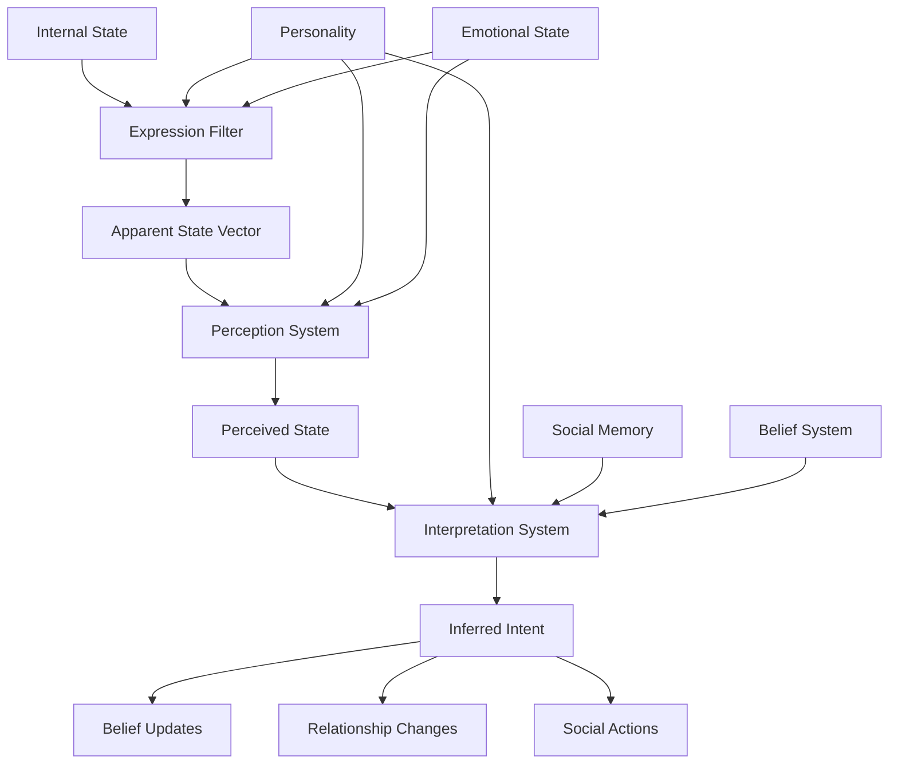

# Design Document

## Overview

The Social Communication Pipeline implements the core "Plato's Cave" innovation where agents communicate through imperfect layers of expression, perception, and interpretation. This design creates the misunderstandings and subjective social dynamics that make NPCs feel authentically human while generating emergent social drama.

## Architecture

### Core Design Principles

1. **Four-Layer Pipeline**: Internal State → Expression → Perception → Interpretation
2. **Information Loss by Design**: Each layer introduces realistic distortion and bias
3. **Personality-Driven Filtering**: All layers modulated by observer and expresser personality
4. **Temporal Consistency**: Social memory and relationships evolve over virtual time
5. **Cascade Effects**: Misunderstandings propagate through social networks

### System Architecture Diagram



## Components and Interfaces

### Layer 1: Internal State (The Truth)

#### Internal Emotional State
```rust
/// The agent's true internal emotional state - never directly accessible to others.
/// 
/// This represents what the agent is actually feeling, which may differ significantly
/// from what they express or what others perceive.
#[derive(Component, Debug, Reflect, Default)]
#[reflect(Component)]
pub struct InternalEmotionalState {
    /// True pleasure/displeasure: -1.0 to 1.0
    pub true_valence: f32,
    
    /// True activation level: -1.0 to 1.0
    pub true_arousal: f32,
    
    /// True sense of control: -1.0 to 1.0
    pub true_dominance: f32,
    
    /// Internal confidence in current emotional assessment
    pub emotional_certainty: f32,
}
```

### Layer 2: Expression (The Mask)

#### Apparent State Vector
```rust
/// What other agents can observe about this agent's state.
/// 
/// This is the filtered, personality-modulated expression of internal state.
/// The gap between internal state and apparent state creates social complexity.
#[derive(Component, Debug, Reflect, Default)]
#[reflect(Component)]
pub struct ApparentStateVector {
    /// Observable tension/relaxation: -1.0 (very relaxed) to 1.0 (very tense)
    pub tension_relaxation: f32,
    
    /// Observable openness/closure: -1.0 (very closed) to 1.0 (very open)
    pub openness_closure: f32,
    
    /// Observable dominance/submission: -1.0 (submissive) to 1.0 (dominant)
    pub dominance_submission: f32,
    
    /// Observable focus/distraction: -1.0 (distracted) to 1.0 (focused)
    pub focus_distraction: f32,
}

impl ApparentStateVector {
    pub fn calculate_from_internal(
        internal: &InternalEmotionalState,
        personality: &Personality,
        stress: &StressSystem,
        social_context: SocialContext,
    ) -> Self {
        let mut apparent = Self::default();
        
        // Base mapping from internal to apparent
        apparent.tension_relaxation = internal.true_arousal * 0.8;
        apparent.openness_closure = internal.true_valence * 0.6;
        apparent.dominance_submission = internal.true_dominance * 0.7;
        apparent.focus_distraction = (1.0 - stress.acute_stress.value()) * 0.9;
        
        // Personality-based expression filtering
        let extraversion = personality.extraversion.value();
        let conscientiousness = personality.conscientiousness.value();
        let neuroticism = personality.neuroticism.value();
        
        // Introverts suppress expression
        if extraversion < 0.4 {
            let suppression = (0.4 - extraversion) * 2.0; // 0.0 to 0.8
            apparent.openness_closure *= 1.0 - suppression;
            apparent.tension_relaxation *= 1.0 - (suppression * 0.5);
        }
        
        // High conscientiousness suppresses negative expression in public
        if conscientiousness > 0.6 && social_context == SocialContext::Public {
            if apparent.tension_relaxation > 0.0 {
                apparent.tension_relaxation *= 1.0 - (conscientiousness - 0.6) * 2.0;
            }
        }
        
        // High neuroticism amplifies stress expression
        if neuroticism > 0.6 {
            let amplification = (neuroticism - 0.6) * 2.5;
            apparent.tension_relaxation += amplification * stress.acute_stress.value();
        }
        
        // Clamp all values to valid ranges
        apparent.clamp_all(-1.0, 1.0);
        
        apparent
    }
}
```

### Layer 3: Perception (The Distorted Eye)

#### Perception Buffer
```rust
/// Stores an agent's current perceptions of other agents.
/// 
/// These perceptions are filtered through the observer's own emotional state,
/// personality, and existing beliefs, creating subjective interpretations.
#[derive(Component, Debug, Default)]
pub struct PerceptionBuffer {
    /// Currently perceived agents and their apparent states
    pub perceived_agents: HashMap<Entity, PerceivedAgent>,
    
    /// Attention allocation among perceived agents
    pub attention_allocation: HashMap<Entity, f32>,
    
    /// Total attention capacity (affected by energy and stress)
    pub attention_capacity: f32,
}

#[derive(Debug, Clone)]
pub struct PerceivedAgent {
    /// The entity being perceived
    pub entity: Entity,
    
    /// What the observer thinks this agent's state is
    pub perceived_vector: ApparentStateVector,
    
    /// Confidence in this perception (0.0 to 1.0)
    pub perception_confidence: f32,
    
    /// When this perception was last updated
    pub last_updated: f64,
    
    /// How much attention is being paid to this agent
    pub attention_level: f32,
}

impl PerceptionBuffer {
    pub fn update_perception(
        &mut self,
        target_entity: Entity,
        actual_apparent_state: &ApparentStateVector,
        observer_personality: &Personality,
        observer_emotion: &InternalEmotionalState,
        observer_beliefs: &BeliefSystem,
        distance: f32,
        world_time: f64,
    ) {
        // Calculate attention allocation
        let base_attention = self.calculate_attention_priority(target_entity, distance);
        let available_attention = self.attention_capacity * base_attention;
        
        if available_attention < 0.1 {
            return; // Not enough attention to perceive this agent
        }
        
        // Apply perceptual distortion
        let mut perceived_state = *actual_apparent_state;
        
        // Observer's emotional state colors perception
        if observer_emotion.true_valence < -0.3 {
            // Negative mood increases perceived threat/tension
            perceived_state.tension_relaxation += 0.2;
            perceived_state.openness_closure -= 0.3;
        } else if observer_emotion.true_valence > 0.3 {
            // Positive mood increases perceived friendliness
            perceived_state.openness_closure += 0.2;
            perceived_state.tension_relaxation -= 0.1;
        }
        
        // Personality-based perception bias
        let agreeableness = observer_personality.agreeableness.value();
        if agreeableness > 0.6 {
            // High agreeableness sees others as more friendly
            perceived_state.openness_closure += 0.2;
        } else if agreeableness < 0.4 {
            // Low agreeableness sees others as more hostile
            perceived_state.dominance_submission += 0.3;
            perceived_state.tension_relaxation += 0.2;
        }
        
        // Existing beliefs influence perception (confirmation bias)
        if let Some(belief) = observer_beliefs.entity_beliefs.get(&target_entity) {
            let bias_strength = belief.confidence * 0.3;
            perceived_state.openness_closure += belief.behavioral_expectation.friendliness * bias_strength;
            perceived_state.dominance_submission += belief.behavioral_expectation.trustworthiness * bias_strength;
        }
        
        // Distance and attention affect perception accuracy
        let accuracy = (available_attention * (1.0 - distance / 10.0)).clamp(0.1, 1.0);
        let noise_factor = 1.0 - accuracy;
        perceived_state.add_noise(noise_factor * 0.4);
        
        // Store perception
        self.perceived_agents.insert(target_entity, PerceivedAgent {
            entity: target_entity,
            perceived_vector: perceived_state,
            perception_confidence: accuracy,
            last_updated: world_time,
            attention_level: available_attention,
        });
        
        self.attention_allocation.insert(target_entity, available_attention);
    }
}
```

### Layer 4: Interpretation (The Interpretation)

#### Social Inference System
```rust
/// Interprets perceived behaviors and infers intentions and character traits.
/// 
/// This system is where most misunderstandings occur, as agents try to guess
/// what others are thinking based on limited and biased observations.
#[derive(Component, Debug, Default)]
pub struct SocialInferenceSystem {
    /// Behavioral prototypes for pattern matching
    pub behavior_prototypes: HashMap<IntentType, BehaviorPrototype>,
    
    /// Recent inferences about other agents
    pub recent_inferences: HashMap<Entity, Vec<InferredIntent>>,
}

#[derive(Debug, Clone)]
pub struct BehaviorPrototype {
    /// Expected apparent state for this intent type
    pub expected_state: ApparentStateVector,
    
    /// How confident we are in this prototype
    pub prototype_confidence: f32,
    
    /// How often this prototype has been correct
    pub accuracy_history: f32,
}

#[derive(Debug, Clone)]
pub struct InferredIntent {
    /// What we think the other agent intends to do
    pub intent_type: IntentType,
    
    /// How confident we are in this inference
    pub confidence: f32,
    
    /// When this inference was made
    pub timestamp: f64,
    
    /// What evidence led to this inference
    pub evidence: Vec<String>,
}

#[derive(Debug, Clone, Copy, PartialEq, Eq, Hash)]
pub enum IntentType {
    Friendly,
    Hostile,
    Neutral,
    Seeking,
    Avoiding,
    Dominant,
    Submissive,
    Distressed,
    Content,
}

impl SocialInferenceSystem {
    pub fn infer_intent(
        &mut self,
        target_entity: Entity,
        perceived_state: &ApparentStateVector,
        observer_personality: &Personality,
        observer_beliefs: &BeliefSystem,
        world_time: f64,
    ) -> InferredIntent {
        let mut best_match = IntentType::Neutral;
        let mut best_confidence = 0.0;
        let mut evidence = Vec::new();
        
        // Compare against behavioral prototypes
        for (intent_type, prototype) in &self.behavior_prototypes {
            let similarity = self.calculate_similarity(perceived_state, &prototype.expected_state);
            let confidence = similarity * prototype.prototype_confidence * prototype.accuracy_history;
            
            if confidence > best_confidence {
                best_confidence = confidence;
                best_match = *intent_type;
            }
        }
        
        // Apply personality bias to interpretation
        let neuroticism = observer_personality.neuroticism.value();
        if neuroticism > 0.6 {
            // High neuroticism biases toward threat interpretation
            if best_match == IntentType::Neutral && perceived_state.tension_relaxation > 0.2 {
                best_match = IntentType::Hostile;
                best_confidence += 0.3;
                evidence.push("High neuroticism bias toward threat".to_string());
            }
        }
        
        // Apply existing beliefs (confirmation bias)
        if let Some(belief) = observer_beliefs.entity_beliefs.get(&target_entity) {
            if belief.behavioral_expectation.friendliness < -0.3 && best_match == IntentType::Neutral {
                best_match = IntentType::Hostile;
                best_confidence += belief.confidence * 0.4;
                evidence.push("Existing negative belief bias".to_string());
            }
        }
        
        let inference = InferredIntent {
            intent_type: best_match,
            confidence: best_confidence.clamp(0.0, 0.95), // Never 100% certain
            timestamp: world_time,
            evidence,
        };
        
        // Store inference history
        self.recent_inferences
            .entry(target_entity)
            .or_insert_with(Vec::new)
            .push(inference.clone());
        
        inference
    }
}
```

## Data Models

### Communication Events

#### Social Communication Events
```rust
#[derive(Event, Debug)]
pub struct CommunicationAttempt {
    pub sender: Entity,
    pub receiver: Entity,
    pub intended_message: IntentType,
    pub emotional_context: f32,
    pub timestamp: f64,
}

#[derive(Event, Debug)]
pub struct CommunicationReceived {
    pub sender: Entity,
    pub receiver: Entity,
    pub perceived_message: IntentType,
    pub interpretation_confidence: f32,
    pub misunderstanding_detected: bool,
    pub timestamp: f64,
}

#[derive(Event, Debug)]
pub struct MisunderstandingCascade {
    pub original_sender: Entity,
    pub cascade_path: Vec<Entity>,
    pub original_intent: IntentType,
    pub final_interpretation: IntentType,
    pub distortion_level: f32,
    pub timestamp: f64,
}
```

### Relationship Management

#### Dynamic Relationship Component
```rust
/// Tracks the evolving relationship between two agents.
/// 
/// Relationships change based on interaction outcomes and perceived intentions.
/// Multiple relationship dimensions capture the complexity of social bonds.
#[derive(Component, Debug)]
pub struct RelationshipComponent {
    /// Relationships with other entities
    pub relationships: HashMap<Entity, Relationship>,
}

#[derive(Debug, Clone)]
pub struct Relationship {
    /// Trust level: -1.0 = complete distrust, 1.0 = complete trust
    pub trust_level: f32,
    
    /// Emotional attachment: -1.0 = strong aversion, 1.0 = strong attachment
    pub emotional_attachment: f32,
    
    /// Perceived social status: -1.0 = much lower, 1.0 = much higher
    pub perceived_status: f32,
    
    /// Familiarity: 0.0 = stranger, 1.0 = very familiar
    pub familiarity: f32,
    
    /// Recent interaction trend: -1.0 = getting worse, 1.0 = getting better
    pub interaction_trend: f32,
    
    /// When this relationship was last updated
    pub last_updated: f64,
    
    /// Number of interactions that formed this relationship
    pub interaction_count: u32,
}

impl Relationship {
    pub fn update_from_interaction(
        &mut self,
        interaction_outcome: InteractionOutcome,
        perceived_intent: IntentType,
        emotional_intensity: f32,
        world_time: f64,
    ) {
        let outcome_value = match interaction_outcome {
            InteractionOutcome::VeryPositive => 0.3,
            InteractionOutcome::Positive => 0.15,
            InteractionOutcome::Neutral => 0.0,
            InteractionOutcome::Negative => -0.2,
            InteractionOutcome::VeryNegative => -0.4,
        };
        
        // Update trust based on outcome and perceived intent
        let trust_change = outcome_value * (1.0 + emotional_intensity * 0.5);
        self.trust_level = (self.trust_level + trust_change).clamp(-1.0, 1.0);
        
        // Update emotional attachment (stronger for intense interactions)
        let attachment_change = outcome_value * emotional_intensity * 0.3;
        self.emotional_attachment = (self.emotional_attachment + attachment_change).clamp(-1.0, 1.0);
        
        // Increase familiarity
        self.familiarity = (self.familiarity + 0.02).min(1.0);
        
        // Update interaction trend
        let trend_change = outcome_value * 0.4;
        self.interaction_trend = (self.interaction_trend * 0.7 + trend_change * 0.3).clamp(-1.0, 1.0);
        
        self.last_updated = world_time;
        self.interaction_count += 1;
    }
    
    pub fn natural_decay(&mut self, hours_elapsed: f32) {
        // Relationships slowly drift toward neutral without interaction
        let decay_rate = 0.001 * hours_elapsed;
        
        self.trust_level *= 1.0 - decay_rate;
        self.emotional_attachment *= 1.0 - decay_rate;
        self.interaction_trend *= 1.0 - (decay_rate * 2.0); // Trends fade faster
        
        // Familiarity decays very slowly
        self.familiarity *= 1.0 - (decay_rate * 0.1);
    }
}
```

## Error Handling

### Communication Pipeline Validation

#### Pipeline Integrity Monitoring
```rust
/// Monitors the communication pipeline for proper information flow and distortion.
/// 
/// Ensures that the "Plato's Cave" effect is working correctly and that
/// misunderstandings occur at realistic rates.
#[derive(Resource, Default)]
pub struct CommunicationPipelineMonitor {
    pub pipeline_samples: Vec<PipelineSample>,
    pub accuracy_statistics: AccuracyStatistics,
    pub misunderstanding_rates: HashMap<PersonalityProfile, f32>,
}

#[derive(Debug, Clone)]
pub struct PipelineSample {
    pub timestamp: f64,
    pub sender_internal_state: InternalEmotionalState,
    pub expressed_state: ApparentStateVector,
    pub perceived_state: ApparentStateVector,
    pub inferred_intent: IntentType,
    pub actual_intent: IntentType,
    pub expression_accuracy: f32,
    pub perception_accuracy: f32,
    pub interpretation_accuracy: f32,
    pub overall_accuracy: f32,
}

impl CommunicationPipelineMonitor {
    pub fn record_communication(
        &mut self,
        sender_internal: &InternalEmotionalState,
        expressed: &ApparentStateVector,
        perceived: &ApparentStateVector,
        inferred_intent: IntentType,
        actual_intent: IntentType,
        world_time: f64,
    ) {
        let expression_accuracy = self.calculate_expression_accuracy(sender_internal, expressed);
        let perception_accuracy = self.calculate_perception_accuracy(expressed, perceived);
        let interpretation_accuracy = if inferred_intent == actual_intent { 1.0 } else { 0.0 };
        let overall_accuracy = expression_accuracy * perception_accuracy * interpretation_accuracy;
        
        let sample = PipelineSample {
            timestamp: world_time,
            sender_internal_state: *sender_internal,
            expressed_state: *expressed,
            perceived_state: *perceived,
            inferred_intent,
            actual_intent,
            expression_accuracy,
            perception_accuracy,
            interpretation_accuracy,
            overall_accuracy,
        };
        
        self.pipeline_samples.push(sample);
        self.update_statistics();
        
        // Limit sample history for performance
        if self.pipeline_samples.len() > 10000 {
            self.pipeline_samples.drain(0..5000);
        }
    }
    
    pub fn validate_pipeline_health(&self) -> Result<(), String> {
        let recent_samples: Vec<_> = self.pipeline_samples
            .iter()
            .rev()
            .take(1000)
            .collect();
        
        if recent_samples.is_empty() {
            return Err("No communication samples available".to_string());
        }
        
        let avg_overall_accuracy: f32 = recent_samples
            .iter()
            .map(|s| s.overall_accuracy)
            .sum::<f32>() / recent_samples.len() as f32;
        
        // Validate that misunderstandings occur at realistic rates
        if avg_overall_accuracy > 0.8 {
            return Err(format!("Communication too accurate ({:.2}), not enough misunderstandings", avg_overall_accuracy));
        }
        
        if avg_overall_accuracy < 0.2 {
            return Err(format!("Communication too inaccurate ({:.2}), too many misunderstandings", avg_overall_accuracy));
        }
        
        Ok(())
    }
}
```

## Testing Strategy

### Communication Pipeline Testing

#### Misunderstanding Generation Tests
```rust
#[cfg(test)]
mod communication_tests {
    use super::*;
    
    #[test]
    fn test_personality_affects_expression() {
        // Test that introverted agents suppress expression
        let introverted_personality = Personality {
            extraversion: 0.2.into(),
            ..default()
        };
        
        let extraverted_personality = Personality {
            extraversion: 0.8.into(),
            ..default()
        };
        
        let internal_state = InternalEmotionalState {
            true_valence: 0.8,
            true_arousal: 0.6,
            true_dominance: 0.4,
            emotional_certainty: 0.9,
        };
        
        let introverted_expression = ApparentStateVector::calculate_from_internal(
            &internal_state,
            &introverted_personality,
            &StressSystem::default(),
            SocialContext::Public,
        );
        
        let extraverted_expression = ApparentStateVector::calculate_from_internal(
            &internal_state,
            &extraverted_personality,
            &StressSystem::default(),
            SocialContext::Public,
        );
        
        assert!(extraverted_expression.openness_closure > introverted_expression.openness_closure,
                "Extraverted agents should express emotions more openly");
    }
    
    #[test]
    fn test_perception_bias() {
        let mut perception_buffer = PerceptionBuffer::default();
        perception_buffer.attention_capacity = 1.0;
        
        let actual_state = ApparentStateVector {
            tension_relaxation: 0.0,
            openness_closure: 0.0,
            dominance_submission: 0.0,
            focus_distraction: 0.0,
        };
        
        // Observer with negative emotional state
        let negative_observer_emotion = InternalEmotionalState {
            true_valence: -0.6,
            ..default()
        };
        
        // Observer with positive emotional state
        let positive_observer_emotion = InternalEmotionalState {
            true_valence: 0.6,
            ..default()
        };
        
        let target_entity = Entity::from_raw(1);
        
        perception_buffer.update_perception(
            target_entity,
            &actual_state,
            &Personality::default(),
            &negative_observer_emotion,
            &BeliefSystem::default(),
            1.0,
            100.0,
        );
        
        let negative_perception = perception_buffer.perceived_agents.get(&target_entity).unwrap();
        
        perception_buffer.update_perception(
            target_entity,
            &actual_state,
            &Personality::default(),
            &positive_observer_emotion,
            &BeliefSystem::default(),
            1.0,
            200.0,
        );
        
        let positive_perception = perception_buffer.perceived_agents.get(&target_entity).unwrap();
        
        assert!(positive_perception.perceived_vector.openness_closure > 
                negative_perception.perceived_vector.openness_closure,
                "Positive emotional state should bias perception toward friendliness");
    }
}
```

This social communication pipeline design creates the core "Plato's Cave" system that generates believable misunderstandings and social complexity through layered information distortion, making NPCs feel authentically human in their social interactions.