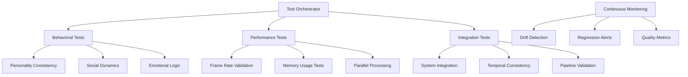

# Design Document

## Overview

The Testing and Validation system ensures that AI agents maintain behavioral believability and technical performance through comprehensive automated testing. This design validates the "Social Turing Test" achievement while preventing regressions in both performance and social dynamics.

## Architecture

### Core Design Principles

1. **Behavioral Believability Testing**: Automated validation of human-like AI behavior
2. **Performance Regression Prevention**: Continuous monitoring of 60fps targets
3. **Emergent Behavior Validation**: Detection of broken social dynamics
4. **Long-term Stability Testing**: Prevention of drift over virtual time
5. **Player Experience Simulation**: Validation of authentic social interactions

### System Architecture Diagram



## Components and Interfaces

### Behavioral Testing Framework

#### Personality Consistency Validator
```rust
/// Validates that personality traits create consistent, observable behavioral differences.
/// 
/// Tests that agents with different Big Five profiles exhibit measurably different
/// behaviors across multiple scenarios and time periods.
#[derive(Debug)]
pub struct PersonalityConsistencyValidator {
    pub test_scenarios: Vec<PersonalityTestScenario>,
    pub consistency_thresholds: PersonalityThresholds,
    pub validation_results: Vec<PersonalityValidationResult>,
}

#[derive(Debug, Clone)]
pub struct PersonalityTestScenario {
    pub scenario_name: String,
    pub test_duration: f32,
    pub agent_configurations: Vec<TestAgentConfig>,
    pub expected_behavioral_differences: Vec<BehavioralExpectation>,
}

#[derive(Debug, Clone)]
pub struct TestAgentConfig {
    pub personality: Personality,
    pub initial_needs: Needs,
    pub initial_emotional_state: EmotionalState,
    pub expected_behavior_profile: BehaviorProfile,
}

impl PersonalityConsistencyValidator {
    pub fn run_personality_test(&mut self, scenario: &PersonalityTestScenario) -> PersonalityValidationResult {
        let mut app = self.create_test_app();
        let mut agent_entities = Vec::new();
        
        // Spawn test agents with different personalities
        for config in &scenario.agent_configurations {
            let entity = app.world.spawn((
                config.personality.clone(),
                config.initial_needs.clone(),
                config.initial_emotional_state.clone(),
                ActionTendencies::default(),
                DecisionWeightingProfile::new_from_personality(&config.personality),
            )).id();
            agent_entities.push(entity);
        }
        
        // Run simulation for test duration
        let frames_to_run = (scenario.test_duration * 60.0) as usize; // 60 FPS
        for _ in 0..frames_to_run {
            app.update();
        }
        
        // Analyze behavioral differences
        let behavioral_measurements = self.measure_agent_behaviors(&app, &agent_entities);
        let consistency_score = self.calculate_consistency_score(&behavioral_measurements, scenario);
        
        PersonalityValidationResult {
            scenario_name: scenario.scenario_name.clone(),
            consistency_score,
            behavioral_measurements,
            passed: consistency_score > self.consistency_thresholds.minimum_consistency,
            details: self.generate_validation_details(&behavioral_measurements, scenario),
        }
    }
    
    fn measure_agent_behaviors(&self, app: &App, agents: &[Entity]) -> Vec<BehavioralMeasurement> {
        agents.iter().map(|&entity| {
            let personality = app.world.get::<Personality>(entity).unwrap();
            let tendencies = app.world.get::<ActionTendencies>(entity).unwrap();
            let decision_weights = app.world.get::<DecisionWeightingProfile>(entity).unwrap();
            
            BehavioralMeasurement {
                entity,
                personality: personality.clone(),
                social_seeking_level: tendencies.social_seeking,
                exploration_tendency: tendencies.exploration_drive,
                risk_aversion: tendencies.safety_priority,
                emotional_reactivity: decision_weights.emotional_weight,
                deliberative_tendency: decision_weights.deliberative_weight,
            }
        }).collect()
    }
}
```

#### Social Dynamics Validator
```rust
/// Validates that social interactions produce realistic dynamics and outcomes.
/// 
/// Tests misunderstanding rates, relationship formation, and conflict generation
/// to ensure the "Plato's Cave" communication system works correctly.
#[derive(Debug)]
pub struct SocialDynamicsValidator {
    pub misunderstanding_rate_target: f32, // 20-40% target range
    pub relationship_formation_tests: Vec<RelationshipTest>,
    pub conflict_generation_tests: Vec<ConflictTest>,
}

#[derive(Debug, Clone)]
pub struct RelationshipTest {
    pub test_name: String,
    pub agent_personalities: (Personality, Personality),
    pub interaction_sequence: Vec<InteractionType>,
    pub expected_relationship_outcome: RelationshipOutcome,
    pub tolerance: f32,
}

impl SocialDynamicsValidator {
    pub fn validate_misunderstanding_rates(&mut self) -> ValidationResult {
        let mut app = self.create_social_test_app();
        let mut communication_monitor = CommunicationPipelineMonitor::default();
        
        // Create agents with varied personalities
        let agents = self.spawn_diverse_agent_population(&mut app, 20);
        
        // Run social interactions
        for _ in 0..1000 { // Run many interaction cycles
            app.update();
            
            // Record communication attempts and outcomes
            // This would be integrated with the actual communication system
        }
        
        let misunderstanding_rate = communication_monitor.calculate_misunderstanding_rate();
        
        ValidationResult {
            test_name: "Misunderstanding Rate Validation".to_string(),
            passed: (0.2..=0.4).contains(&misunderstanding_rate),
            score: if (0.2..=0.4).contains(&misunderstanding_rate) { 1.0 } else { 0.0 },
            details: format!("Misunderstanding rate: {:.1}% (target: 20-40%)", misunderstanding_rate * 100.0),
            metrics: vec![
                ("misunderstanding_rate".to_string(), misunderstanding_rate),
                ("communication_attempts".to_string(), communication_monitor.total_attempts as f32),
            ],
        }
    }
    
    pub fn validate_relationship_formation(&mut self, test: &RelationshipTest) -> ValidationResult {
        let mut app = self.create_test_app();
        
        // Spawn two agents with specified personalities
        let agent_a = app.world.spawn((
            test.agent_personalities.0.clone(),
            SocialMemory::default(),
            RelationshipComponent::default(),
            BeliefSystem::default(),
        )).id();
        
        let agent_b = app.world.spawn((
            test.agent_personalities.1.clone(),
            SocialMemory::default(),
            RelationshipComponent::default(),
            BeliefSystem::default(),
        )).id();
        
        // Execute interaction sequence
        for interaction_type in &test.interaction_sequence {
            self.simulate_interaction(&mut app, agent_a, agent_b, *interaction_type);
            
            // Run several update cycles to process the interaction
            for _ in 0..10 {
                app.update();
            }
        }
        
        // Measure final relationship state
        let relationship_a = app.world.get::<RelationshipComponent>(agent_a).unwrap();
        let relationship_b = app.world.get::<RelationshipComponent>(agent_b).unwrap();
        
        let actual_outcome = self.measure_relationship_outcome(relationship_a, relationship_b, agent_a, agent_b);
        let difference = self.calculate_relationship_difference(&actual_outcome, &test.expected_relationship_outcome);
        
        ValidationResult {
            test_name: test.test_name.clone(),
            passed: difference <= test.tolerance,
            score: (1.0 - difference).max(0.0),
            details: format!("Relationship difference: {:.2} (tolerance: {:.2})", difference, test.tolerance),
            metrics: vec![
                ("trust_difference".to_string(), (actual_outcome.trust_level - test.expected_relationship_outcome.trust_level).abs()),
                ("attachment_difference".to_string(), (actual_outcome.emotional_attachment - test.expected_relationship_outcome.emotional_attachment).abs()),
            ],
        }
    }
}
```

### Performance Testing Framework

#### Frame Rate Validator
```rust
/// Validates that the simulation maintains target frame rates under various loads.
/// 
/// Tests performance with different agent counts, time scales, and complexity levels
/// to ensure the 60fps target is maintained in realistic scenarios.
#[derive(Debug)]
pub struct FrameRateValidator {
    pub target_fps: f32,
    pub test_configurations: Vec<PerformanceTestConfig>,
    pub hardware_simulation: HardwareSimulation,
}

#[derive(Debug, Clone)]
pub struct PerformanceTestConfig {
    pub test_name: String,
    pub agent_count: usize,
    pub time_scale: f32,
    pub test_duration: f32,
    pub complexity_level: ComplexityLevel,
    pub player_count: usize,
    pub player_distribution: PlayerDistribution,
}

#[derive(Debug, Clone)]
pub enum ComplexityLevel {
    Minimal,    // Basic needs and simple decisions
    Standard,   // Full AI with social interactions
    Maximum,    // All systems active with complex scenarios
}

impl FrameRateValidator {
    pub fn run_performance_test(&mut self, config: &PerformanceTestConfig) -> PerformanceValidationResult {
        // Set up hardware simulation constraints
        self.hardware_simulation.apply_constraints();
        
        let mut app = self.create_performance_test_app(config);
        let mut frame_times = Vec::new();
        let mut memory_samples = Vec::new();
        
        let frames_to_run = (config.test_duration * config.time_scale * 60.0) as usize;
        
        for frame in 0..frames_to_run {
            let frame_start = std::time::Instant::now();
            
            app.update();
            
            let frame_time = frame_start.elapsed().as_secs_f32();
            frame_times.push(frame_time);
            
            // Sample memory usage every 60 frames
            if frame % 60 == 0 {
                memory_samples.push(self.get_memory_usage());
            }
        }
        
        let average_fps = 1.0 / (frame_times.iter().sum::<f32>() / frame_times.len() as f32);
        let min_fps = 1.0 / frame_times.iter().max_by(|a, b| a.partial_cmp(b).unwrap()).unwrap();
        let frame_time_variance = self.calculate_variance(&frame_times);
        
        let max_memory = memory_samples.iter().max().copied().unwrap_or(0);
        let memory_growth = memory_samples.last().unwrap_or(&0) - memory_samples.first().unwrap_or(&0);
        
        PerformanceValidationResult {
            test_name: config.test_name.clone(),
            passed: average_fps >= self.target_fps && min_fps >= self.target_fps * 0.9,
            average_fps,
            min_fps,
            frame_time_variance,
            max_memory_mb: max_memory as f32 / 1_000_000.0,
            memory_growth_mb: memory_growth as f32 / 1_000_000.0,
            agent_count: config.agent_count,
            details: format!(
                "Avg FPS: {:.1}, Min FPS: {:.1}, Memory: {:.1}MB, Growth: {:.1}MB",
                average_fps, min_fps, max_memory as f32 / 1_000_000.0, memory_growth as f32 / 1_000_000.0
            ),
        }
    }
}
```

### Integration Testing Framework

#### System Integration Validator
```rust
/// Validates that all AI systems work together correctly without conflicts.
/// 
/// Tests the integration between physiological, cognitive, and social systems
/// to ensure emergent complexity arises from simple component interactions.
#[derive(Debug)]
pub struct SystemIntegrationValidator {
    pub integration_tests: Vec<IntegrationTest>,
    pub temporal_consistency_tests: Vec<TemporalTest>,
    pub pipeline_validation_tests: Vec<PipelineTest>,
}

#[derive(Debug, Clone)]
pub struct IntegrationTest {
    pub test_name: String,
    pub systems_under_test: Vec<String>,
    pub test_scenario: IntegrationScenario,
    pub expected_emergent_behaviors: Vec<EmergentBehavior>,
    pub validation_criteria: Vec<ValidationCriterion>,
}

impl SystemIntegrationValidator {
    pub fn validate_physiological_cognitive_integration(&mut self) -> ValidationResult {
        let mut app = self.create_integration_test_app();
        
        // Create agent with specific physiological state
        let agent = app.world.spawn((
            Needs {
                hunger: 0.9.into(),    // Very hungry
                energy: 0.2.into(),    // Very tired
                safety: 0.1.into(),    // Feels safe
                social: 0.6.into(),    // Moderately lonely
            },
            Personality {
                conscientiousness: 0.8.into(), // High conscientiousness
                neuroticism: 0.3.into(),       // Low neuroticism
                ..default()
            },
            StressSystem::default(),
            EmotionalState::default(),
            DecisionWeightingProfile::default(),
            ActionTendencies::default(),
        )).id();
        
        // Run simulation to see how physiological state affects cognitive decisions
        for _ in 0..300 { // 5 seconds at 60fps
            app.update();
        }
        
        // Validate that high hunger and low energy led to appropriate decision changes
        let tendencies = app.world.get::<ActionTendencies>(agent).unwrap();
        let decision_weights = app.world.get::<DecisionWeightingProfile>(agent).unwrap();
        
        let resource_focus_increased = tendencies.resource_focus > 0.7;
        let deliberative_weight_decreased = decision_weights.deliberative_weight < 0.4; // Tired = less deliberative
        let safety_priority_low = tendencies.safety_priority < 0.5; // Not stressed despite needs
        
        ValidationResult {
            test_name: "Physiological-Cognitive Integration".to_string(),
            passed: resource_focus_increased && deliberative_weight_decreased && safety_priority_low,
            score: [resource_focus_increased, deliberative_weight_decreased, safety_priority_low]
                .iter()
                .map(|&b| if b { 1.0 } else { 0.0 })
                .sum::<f32>() / 3.0,
            details: format!(
                "Resource focus: {:.2}, Deliberative weight: {:.2}, Safety priority: {:.2}",
                tendencies.resource_focus, decision_weights.deliberative_weight, tendencies.safety_priority
            ),
            metrics: vec![
                ("resource_focus".to_string(), tendencies.resource_focus),
                ("deliberative_weight".to_string(), decision_weights.deliberative_weight),
                ("safety_priority".to_string(), tendencies.safety_priority),
            ],
        }
    }
}
```

### Continuous Monitoring System

#### Drift Detection Monitor
```rust
/// Continuously monitors for value drift and system instability.
/// 
/// Detects gradual changes in behavioral parameters that could lead to
/// unrealistic agent behavior over long simulation periods.
#[derive(Resource, Debug, Default)]
pub struct DriftDetectionMonitor {
    pub monitored_entities: HashMap<Entity, EntityDriftHistory>,
    pub global_drift_metrics: GlobalDriftMetrics,
    pub drift_alerts: Vec<DriftAlert>,
    pub monitoring_config: DriftMonitoringConfig,
}

#[derive(Debug, Clone)]
pub struct EntityDriftHistory {
    pub entity: Entity,
    pub personality_history: VecDeque<PersonalitySnapshot>,
    pub emotional_history: VecDeque<EmotionalSnapshot>,
    pub behavioral_history: VecDeque<BehavioralSnapshot>,
    pub drift_scores: HashMap<String, f32>,
}

#[derive(Debug, Clone)]
pub struct PersonalitySnapshot {
    pub timestamp: f64,
    pub traits: [f32; 5], // Big Five traits
    pub stability_score: f32,
}

impl DriftDetectionMonitor {
    pub fn monitor_entity(&mut self, entity: Entity, world: &World, world_time: f64) {
        let history = self.monitored_entities.entry(entity).or_insert_with(|| EntityDriftHistory {
            entity,
            personality_history: VecDeque::new(),
            emotional_history: VecDeque::new(),
            behavioral_history: VecDeque::new(),
            drift_scores: HashMap::new(),
        });
        
        // Record current state
        if let Some(personality) = world.get::<Personality>(entity) {
            let snapshot = PersonalitySnapshot {
                timestamp: world_time,
                traits: [
                    personality.openness.value(),
                    personality.conscientiousness.value(),
                    personality.extraversion.value(),
                    personality.agreeableness.value(),
                    personality.neuroticism.value(),
                ],
                stability_score: self.calculate_personality_stability(&history.personality_history),
            };
            
            history.personality_history.push_back(snapshot);
            
            if history.personality_history.len() > 1000 {
                history.personality_history.pop_front();
            }
        }
        
        // Check for drift patterns
        if history.personality_history.len() >= 50 {
            let drift_score = self.calculate_personality_drift_score(&history.personality_history);
            history.drift_scores.insert("personality".to_string(), drift_score);
            
            if drift_score > self.monitoring_config.personality_drift_threshold {
                self.drift_alerts.push(DriftAlert {
                    entity,
                    alert_type: DriftAlertType::PersonalityDrift,
                    severity: drift_score,
                    description: format!("Personality drift detected: score {:.3}", drift_score),
                    timestamp: world_time,
                    affected_systems: vec!["personality".to_string(), "decision_making".to_string()],
                });
            }
        }
    }
    
    pub fn generate_drift_report(&self) -> DriftReport {
        let total_entities = self.monitored_entities.len();
        let entities_with_drift = self.monitored_entities
            .values()
            .filter(|history| {
                history.drift_scores.values().any(|&score| score > 0.1)
            })
            .count();
        
        let average_drift_scores: HashMap<String, f32> = ["personality", "emotional", "behavioral"]
            .iter()
            .map(|&metric| {
                let scores: Vec<f32> = self.monitored_entities
                    .values()
                    .filter_map(|history| history.drift_scores.get(metric))
                    .copied()
                    .collect();
                
                let average = if scores.is_empty() {
                    0.0
                } else {
                    scores.iter().sum::<f32>() / scores.len() as f32
                };
                
                (metric.to_string(), average)
            })
            .collect();
        
        DriftReport {
            total_entities_monitored: total_entities,
            entities_with_drift,
            drift_percentage: (entities_with_drift as f32 / total_entities as f32) * 100.0,
            average_drift_scores,
            recent_alerts: self.drift_alerts.iter().rev().take(10).cloned().collect(),
            recommendations: self.generate_drift_recommendations(),
        }
    }
}
```

This testing and validation design ensures comprehensive coverage of both technical performance and behavioral believability, providing the tools needed to maintain the "Social Turing Test" quality while preventing regressions in the complex AI systems.